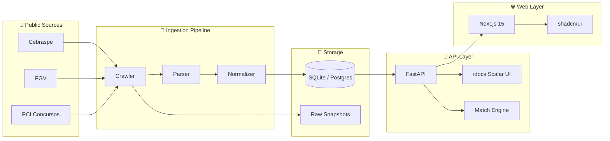

<div align="center">

# 🛰️ CivicRadar

### **Open source radar for Brazilian public career opportunities**

_Find, filter and track Brazilian public tenders that match your profile._

[](./LICENSE)
[](https://github.com/merlinfachetti/civic-radar/actions/workflows/ci-api.yml)
[](https://github.com/merlinfachetti/civic-radar/actions/workflows/ci-web.yml)
[](https://github.com/merlinfachetti/civic-radar/actions/workflows/ci-crawlers.yml)
[](https://github.com/merlinfachetti/civic-radar/issues?q=is%3Aissue+is%3Aopen+label%3A%22good+first+issue%22)
[](./docs/CONTRIBUTING.md)

[**Quick Start**](#-quick-start) · [**Why?**](#-why-civicradar) · [**Architecture**](#-architecture) · [**Roadmap**](#-roadmap) · [**Contribute**](#-contributing) · [**Docs**](./docs/)

</div>

---

## 🎯 Why CivicRadar?

Information about Brazilian public tenders is **highly fragmented** — scattered across exam-board sites, city halls, agency portals, edital PDFs and private aggregators with no shared format.

For someone looking for an opportunity, that translates into hours of manual hunting site by site, missed deadlines and requirements that are hard to compare across formats.

**CivicRadar turns that fragmentation into a searchable, filterable, traceable radar.** It is an **open source civic-tech** project that respects official sources (always linking back), prioritizes traceability and uses deterministic scoring to answer the question:

> _"Which opportunities actually make sense for my profile?"_

---

## ✨ Features

- 🛰️ **Multi-source ingestion** — Crawlers for Cebraspe, FGV and PCI Concursos (extensible via a plugin architecture)
- 🎯 **Deterministic match score** — Explainable algorithm, no black-box AI (area, location, education, salary, keywords)
- 🔍 **Powerful filters** — By area, state, education level, salary range, status, board and keyword
- 📡 **Modern API** — FastAPI with OpenAPI 3.1, slick Scalar UI at `/docs`, ReDoc at `/redoc`
- 🎨 **Tech-forward frontend** — Next.js 15 + shadcn/ui + Tailwind v4, dark-first, ⌘K command palette, fully responsive
- 🔐 **No login required for the MVP** — Match profile lives locally, no personal data collection
- 📊 **Full traceability** — Every opportunity exposes the original source, verification timestamp and confidence level
- ⚡ **Setup in < 5 min** — `git clone && docker compose up` and you are good to go
- 🧪 **Test-first** — Real HTML/PDF fixtures, coverage gate from day one
- 🌍 **i18n-ready** — PT-BR primary (the audience), EN fallback

---

## 🚀 Quick Start

### Prerequisites

- [Docker](https://docs.docker.com/get-docker/) + [Docker Compose](https://docs.docker.com/compose/install/) — _simplest path_
- **OR** [uv](https://docs.astral.sh/uv/) (Python 3.12+) + [pnpm](https://pnpm.io/) (Node 20+) for native dev

### Docker (recommended)

```bash
git clone https://github.com/merlinfachetti/civic-radar.git
cd civic-radar
docker compose up -d
```

That is it. Open:

| Service | URL | Description |
|---|---|---|
| 🌐 **Web** | http://localhost:3000 | Main interface |
| 📡 **API** | http://localhost:8000 | FastAPI |
| 📖 **Docs (Scalar)** | http://localhost:8000/docs | Navigable OpenAPI |
| 📚 **ReDoc** | http://localhost:8000/redoc | Alternative documentation |
| 💚 **Health** | http://localhost:8000/health | Service status |

### Native development

```bash
# Backend
cd apps/api
uv sync
uv run alembic upgrade head
uv run civic_radar seed              # populate with sample data
uv run civic_radar serve             # http://localhost:8000

# Frontend (in another terminal)
cd apps/web
pnpm install
pnpm dev                             # http://localhost:3000

# Crawlers (offline against fixtures)
cd crawlers
uv run pytest                        # runs every parser against fixtures
```

---

## 🧱 Tech Stack

| Layer | Technology | Why |
|---|---|---|
| **Backend** | [FastAPI](https://fastapi.tiangolo.com/) + [SQLAlchemy 2.0](https://www.sqlalchemy.org/) + [Pydantic v2](https://docs.pydantic.dev/) | Modern, async, native OpenAPI |
| **DB (MVP)** | SQLite (single file) | Zero external dependency, `docker compose up` just works |
| **DB (prod)** | PostgreSQL 16 | Production deploy (configured via env) |
| **Migrations** | [Alembic](https://alembic.sqlalchemy.org/) | Schema versioning |
| **CLI** | [Typer](https://typer.tiangolo.com/) + [Rich](https://rich.readthedocs.io/) | `civic_radar crawl`, `seed`, `export`, `stats` |
| **Crawlers** | [httpx](https://www.python-httpx.org/) + [selectolax](https://github.com/rushter/selectolax) + [pdfplumber](https://github.com/jsvine/pdfplumber) | Fast, modern HTML/PDF parsing |
| **Logging** | [structlog](https://www.structlog.org/) | Structured JSON, correlation IDs |
| **Frontend** | [Next.js 15](https://nextjs.org/) (App Router) + [React 19](https://react.dev/) | Server Components, streaming, SEO |
| **UI** | [shadcn/ui](https://ui.shadcn.com/) + [Tailwind v4](https://tailwindcss.com/) + [Framer Motion](https://www.framer.com/motion/) | Owned components, dark-first |
| **State** | [TanStack Query](https://tanstack.com/query) + [Zod](https://zod.dev/) | Reactive cache, runtime validation |
| **Python tooling** | [uv](https://docs.astral.sh/uv/) + [ruff](https://docs.astral.sh/ruff/) + [mypy](https://mypy.readthedocs.io/) | Rust-based, 10-100× faster |
| **Node tooling** | [pnpm](https://pnpm.io/) | Efficient for monorepo |
| **Tests** | [pytest](https://docs.pytest.org/) + [Vitest](https://vitest.dev/) + real fixtures | TDD from day one |
| **CI** | GitHub Actions (4 workflows) | Fast feedback per layer |

---

## 🏗️ Architecture



Full details in [`docs/ARCHITECTURE.md`](./docs/ARCHITECTURE.md) and [`docs/TECH_FOUNDATION.md`](./docs/TECH_FOUNDATION.md).

---

## 📂 Project Structure

```
civic-radar/
├── apps/
│   ├── api/                  # FastAPI backend
│   └── web/                  # Next.js frontend
├── crawlers/
│   └── crawlers/
│       ├── core/             # Base classes (plugin architecture)
│       └── sources/
│           ├── cebraspe/     # Cebraspe crawler + parser + fixtures
│           ├── fgv/          # FGV crawler + parser + fixtures
│           └── pci_concursos/# PCI Concursos crawler + parser + fixtures
├── packages/
│   ├── shared-schemas/       # OpenAPI-derived TS types
│   └── ui-tokens/            # Design tokens
├── data/
│   └── seeds/                # Local dev seed data
├── docs/                     # All documentation
│   ├── PRODUCT_FOUNDATION.md
│   ├── TECH_FOUNDATION.md
│   ├── ARCHITECTURE.md
│   ├── DATA_SOURCES.md       # How to add a new source
│   ├── CONTRIBUTING.md
│   └── adr/                  # Architecture Decision Records
├── .github/
│   ├── workflows/            # 4 CI workflows
│   └── ISSUE_TEMPLATE/
├── docker-compose.yml
└── README.md
```

---

## 🗺️ Roadmap

| Milestone | Status | Goal |
|---|---|---|
| **M0** — Foundation | ✅ Initial | Repo, docs, license, CI, structure |
| **M1** — Ingestion | 🚧 Active | 3+ sources, parsers, fixtures, normalizer |
| **M2** — API | 🚧 Active | All endpoints, OpenAPI rich, filters, pagination |
| **M3** — Web | 🚧 Active | Pages, components, ⌘K, responsive, a11y |
| **M4** — Match Engine | 🔜 Next | Profile form, scoring, explainability |
| **M5** — Alerts | 📋 Planned | RSS, webhook, email, Telegram/Discord |
| **M6** — Intelligence | 🔮 Future | LLM-assisted summary, requirement extraction |

See the live backlog in [Issues](https://github.com/merlinfachetti/civic-radar/issues) and [Milestones](https://github.com/merlinfachetti/civic-radar/milestones).

---

## 🤝 Contributing

CivicRadar **only makes sense as a community project**. Every contribution counts — from fixing a typo, to adding a new source, improving accessibility, translating the UI or bringing in fresh ideas.

### Where to start?

- 🌱 **First contribution:** [issues labeled `good first issue`](https://github.com/merlinfachetti/civic-radar/issues?q=is%3Aissue+is%3Aopen+label%3A%22good+first+issue%22)
- 📚 **Full guide:** [`docs/CONTRIBUTING.md`](./docs/CONTRIBUTING.md)
- ➕ **Add a new source:** [`docs/DATA_SOURCES.md`](./docs/DATA_SOURCES.md)
- 💬 **Conversation:** [GitHub Discussions](https://github.com/merlinfachetti/civic-radar/discussions)
- 🐛 **Bug or broken parser:** [open an issue](https://github.com/merlinfachetti/civic-radar/issues/new/choose)

### Code of Conduct

This project adopts the [Contributor Covenant](./docs/CODE_OF_CONDUCT.md). By participating you agree to follow it.

---

## 🔒 Security

To responsibly report a vulnerability, see [`docs/SECURITY.md`](./docs/SECURITY.md). **Do not open public issues for vulnerabilities.**

---

## ⚖️ License & Disclaimer

CivicRadar is distributed under [**AGPL-3.0**](./LICENSE).

> **CivicRadar is not an official source.** It is a discovery and organization tool. Always confirm registration details, deadlines and requirements directly with the official channels (organizing board, agency, official gazette). Every opportunity on CivicRadar surfaces a link to the original source.

---

## 🙏 Acknowledgements

- Every person, board, agency and portal that keeps tender information publicly accessible online
- Contributors to this repository (list at [`docs/CONTRIBUTORS.md`](./docs/CONTRIBUTORS.md), coming soon)
- [shadcn/ui](https://ui.shadcn.com/), [FastAPI](https://fastapi.tiangolo.com/), [Next.js](https://nextjs.org/), [Astral](https://astral.sh/) and the rest of the open source projects that make this possible

---

<div align="center">

**Built with ❤️ as a civic-tech tool for Brazil.**

[⭐ Star on GitHub](https://github.com/merlinfachetti/civic-radar) · [🐛 Report bug](https://github.com/merlinfachetti/civic-radar/issues/new/choose) · [💡 Suggest a feature](https://github.com/merlinfachetti/civic-radar/issues/new/choose)

</div>
