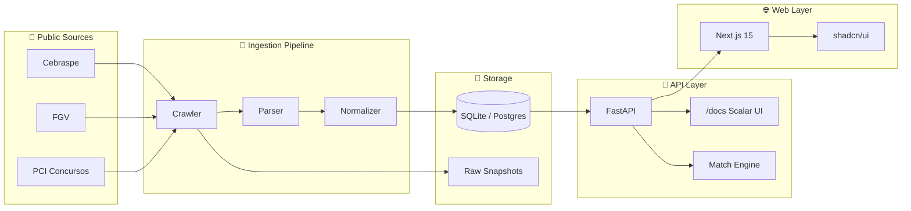

<div align="center">

# 🛰️ CivicRadar

### **Open source radar para oportunidades de carreira pública no Brasil**

_Encontre, filtre e acompanhe concursos públicos brasileiros compatíveis com o seu perfil._

[](./LICENSE)
[](https://github.com/merlinfachetti/civic-radar/actions/workflows/ci-api.yml)
[](https://github.com/merlinfachetti/civic-radar/actions/workflows/ci-web.yml)
[](https://github.com/merlinfachetti/civic-radar/actions/workflows/ci-crawlers.yml)
[](https://github.com/merlinfachetti/civic-radar/issues?q=is%3Aissue+is%3Aopen+label%3A%22good+first+issue%22)
[](./docs/CONTRIBUTING.md)

[**Quick Start**](#-quick-start) · [**Why?**](#-why-civicradar) · [**Architecture**](#-architecture) · [**Roadmap**](#-roadmap) · [**Contribute**](#-contributing) · [**Docs**](./docs/)

</div>

---

## 🎯 Why CivicRadar?

Informações sobre concursos públicos no Brasil são **altamente fragmentadas** — espalhadas entre sites de bancas, prefeituras, portais de órgãos, PDFs de editais e agregadores privados sem padronização.

Para quem está procurando uma oportunidade, isso significa horas perdidas caçando edital por edital, perdendo prazos e tentando comparar requisitos em formatos diferentes.

**CivicRadar transforma essa fragmentação em um radar pesquisável, filtrável e rastreável.** É um projeto **open source civic-tech** que respeita as fontes oficiais (sempre linkando de volta), prioriza rastreabilidade, e usa scoring determinístico para responder à pergunta:

> _"Quais oportunidades realmente fazem sentido para o meu perfil?"_

---

## ✨ Features

- 🛰️ **Multi-source ingestion** — Crawlers para Cebraspe, FGV, PCI Concursos (extensível via plugin architecture)
- 🎯 **Match score determinístico** — Algoritmo explicável, sem caixa-preta de IA (área, localização, escolaridade, salário, palavras-chave)
- 🔍 **Filtros poderosos** — Por área, estado, escolaridade, faixa salarial, status, banca, palavra-chave
- 📡 **API moderna** — FastAPI com OpenAPI 3.1, Scalar UI bonita em `/docs`, ReDoc em `/redoc`
- 🎨 **Frontend tech-forward** — Next.js 15 + shadcn/ui + Tailwind v4, dark-first, ⌘K command palette, totalmente responsivo
- 🔐 **Zero login no MVP** — Perfil de match é local, sem coleta de dados pessoais
- 📊 **Rastreabilidade total** — Cada oportunidade exibe fonte original, data de verificação, e nível de confiança
- ⚡ **Setup em < 5 min** — `git clone && docker compose up` e está pronto
- 🧪 **Test-first** — Fixtures HTML/PDF reais, coverage gate desde o dia 1
- 🌍 **i18n-ready** — PT-BR primário, EN fallback

---

## 🚀 Quick Start

### Pré-requisitos

- [Docker](https://docs.docker.com/get-docker/) + [Docker Compose](https://docs.docker.com/compose/install/) — _setup mais simples_
- **OU** [uv](https://docs.astral.sh/uv/) (Python 3.12+) + [pnpm](https://pnpm.io/) (Node 20+) para dev nativo

### Via Docker (recomendado)

```bash
git clone https://github.com/merlinfachetti/civic-radar.git
cd civic-radar
docker compose up -d
```

Pronto. Acesse:

| Serviço | URL | Descrição |
|---|---|---|
| 🌐 **Web** | http://localhost:3000 | Interface principal |
| 📡 **API** | http://localhost:8000 | FastAPI |
| 📖 **Docs (Scalar)** | http://localhost:8000/docs | OpenAPI navegável |
| 📚 **ReDoc** | http://localhost:8000/redoc | Documentação alternativa |
| 💚 **Health** | http://localhost:8000/health | Status do serviço |

### Via desenvolvimento nativo

```bash
# Backend
cd apps/api
uv sync
uv run alembic upgrade head
uv run civic_radar seed              # popula com dados de exemplo
uv run civic_radar serve             # http://localhost:8000

# Frontend (em outro terminal)
cd apps/web
pnpm install
pnpm dev                             # http://localhost:3000

# Crawlers (offline com fixtures)
cd crawlers
uv run pytest                        # roda todos os parsers contra fixtures
```

---

## 🧱 Tech Stack

| Camada | Tecnologia | Por quê |
|---|---|---|
| **Backend** | [FastAPI](https://fastapi.tiangolo.com/) + [SQLAlchemy 2.0](https://www.sqlalchemy.org/) + [Pydantic v2](https://docs.pydantic.dev/) | API moderna, async, OpenAPI nativo |
| **DB MVP** | SQLite (single-file) | Zero dependência externa, `docker compose up` funciona |
| **DB Prod** | PostgreSQL 16 | Para deploy em produção (configurado via env) |
| **Migrations** | [Alembic](https://alembic.sqlalchemy.org/) | Versionamento de schema |
| **CLI** | [Typer](https://typer.tiangolo.com/) + [Rich](https://rich.readthedocs.io/) | `civic_radar crawl`, `seed`, `export`, `stats` |
| **Crawlers** | [httpx](https://www.python-httpx.org/) + [selectolax](https://github.com/rushter/selectolax) + [pdfplumber](https://github.com/jsvine/pdfplumber) | Rápido, parsing HTML/PDF moderno |
| **Logging** | [structlog](https://www.structlog.org/) | JSON estruturado, correlation IDs |
| **Frontend** | [Next.js 15](https://nextjs.org/) (App Router) + [React 19](https://react.dev/) | Server Components, streaming, SEO |
| **UI** | [shadcn/ui](https://ui.shadcn.com/) + [Tailwind v4](https://tailwindcss.com/) + [Framer Motion](https://www.framer.com/motion/) | Componentes owned, dark-first |
| **State** | [TanStack Query](https://tanstack.com/query) + [Zod](https://zod.dev/) | Cache reativo, validação runtime |
| **Tooling Python** | [uv](https://docs.astral.sh/uv/) + [ruff](https://docs.astral.sh/ruff/) + [mypy](https://mypy.readthedocs.io/) | Rust-based, 10-100× mais rápido |
| **Tooling Node** | [pnpm](https://pnpm.io/) | Eficiente para monorepo |
| **Tests** | [pytest](https://docs.pytest.org/) + [Vitest](https://vitest.dev/) + fixtures reais | TDD desde o dia 1 |
| **CI** | GitHub Actions (4 workflows) | Feedback rápido por camada |

---

## 🏗️ Architecture



Detalhes completos em [`docs/ARCHITECTURE.md`](./docs/ARCHITECTURE.md) e [`docs/TECH_FOUNDATION.md`](./docs/TECH_FOUNDATION.md).

---

## 📂 Project Structure

```
civic-radar/
├── apps/
│   ├── api/                  # FastAPI backend
│   └── web/                  # Next.js frontend
├── crawlers/
│   ├── core/                 # Base classes (plugin architecture)
│   └── sources/
│       ├── cebraspe/         # Cebraspe crawler + parser + fixtures
│       ├── fgv/              # FGV crawler + parser + fixtures
│       └── pci_concursos/    # PCI Concursos crawler + parser + fixtures
├── packages/
│   ├── shared-schemas/       # OpenAPI-derived TS types
│   └── ui-tokens/            # Design tokens
├── data/
│   └── seeds/                # Seed data para dev local
├── docs/                     # Toda documentação
│   ├── PRODUCT_FOUNDATION.md
│   ├── TECH_FOUNDATION.md
│   ├── ARCHITECTURE.md
│   ├── DATA_SOURCES.md       # Como adicionar nova fonte
│   ├── CONTRIBUTING.md
│   └── adr/                  # Architecture Decision Records
├── .github/
│   ├── workflows/            # 4 CI workflows
│   └── ISSUE_TEMPLATE/
├── docker-compose.yml
└── README.md
```

---

## 🗺️ Roadmap

| Milestone | Status | Goal |
|---|---|---|
| **M0** — Foundation | ✅ Initial | Repo, docs, license, CI, structure |
| **M1** — Ingestion | 🚧 Active | 3+ sources, parsers, fixtures, normalizer |
| **M2** — API | 🚧 Active | All endpoints, OpenAPI rich, filters, pagination |
| **M3** — Web | 🚧 Active | Pages, components, ⌘K, responsive, a11y |
| **M4** — Match Engine | 🔜 Next | Profile form, scoring, explainability |
| **M5** — Alerts | 📋 Planned | RSS, webhook, email, Telegram/Discord |
| **M6** — Intelligence | 🔮 Future | LLM-assisted summary, requirement extraction |

Veja o backlog completo nas [Issues](https://github.com/merlinfachetti/civic-radar/issues) e nos [Milestones](https://github.com/merlinfachetti/civic-radar/milestones).

---

## 🤝 Contributing

CivicRadar **só faz sentido como projeto comunitário**. Toda contribuição é valiosa — desde corrigir um typo, adicionar uma nova fonte, melhorar acessibilidade, traduzir UI, ou trazer ideias novas.

### Onde começar?

- 🌱 **Primeira contribuição:** [issues marcadas como `good first issue`](https://github.com/merlinfachetti/civic-radar/issues?q=is%3Aissue+is%3Aopen+label%3A%22good+first+issue%22)
- 📚 **Guia completo:** [`docs/CONTRIBUTING.md`](./docs/CONTRIBUTING.md)
- ➕ **Adicionar nova fonte:** [`docs/DATA_SOURCES.md`](./docs/DATA_SOURCES.md)
- 💬 **Conversa:** [GitHub Discussions](https://github.com/merlinfachetti/civic-radar/discussions)
- 🐛 **Bug ou parser quebrado:** [abra uma issue](https://github.com/merlinfachetti/civic-radar/issues/new/choose)

### Code of Conduct

Este projeto adota o [Contributor Covenant](./docs/CODE_OF_CONDUCT.md). Ao participar, você concorda em respeitar este código.

---

## 🔒 Security

Para reportar vulnerabilidades de forma responsável, veja [`docs/SECURITY.md`](./docs/SECURITY.md). **Não abra issues públicas para vulnerabilidades.**

---

## ⚖️ License & Disclaimer

CivicRadar é distribuído sob a [**AGPL-3.0**](./LICENSE).

> **CivicRadar não é uma fonte oficial.** É uma ferramenta de descoberta e organização. Sempre confirme informações de inscrição, prazos e requisitos diretamente nos canais oficiais (banca organizadora, órgão, diário oficial). Cada oportunidade no CivicRadar exibe link para a fonte original.

---

## 🙏 Acknowledgements

- Todas as pessoas, bancas, órgãos e portais públicos que mantêm informações de concursos acessíveis online
- Contribuidores deste repositório (lista no [`CONTRIBUTORS.md`](./docs/CONTRIBUTORS.md), em breve)
- [shadcn/ui](https://ui.shadcn.com/), [FastAPI](https://fastapi.tiangolo.com/), [Next.js](https://nextjs.org/), [Astral](https://astral.sh/) e demais projetos open source que tornam isso possível

---

<div align="center">

**Construído com ❤️ como ferramenta de civic-tech para o Brasil.**

[⭐ Star no GitHub](https://github.com/merlinfachetti/civic-radar) · [🐛 Reportar bug](https://github.com/merlinfachetti/civic-radar/issues/new/choose) · [💡 Sugerir feature](https://github.com/merlinfachetti/civic-radar/issues/new/choose)

</div>
