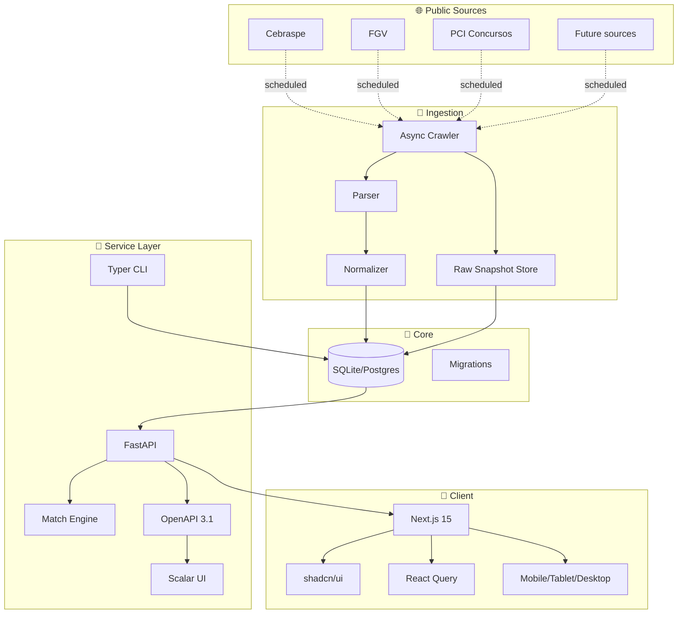
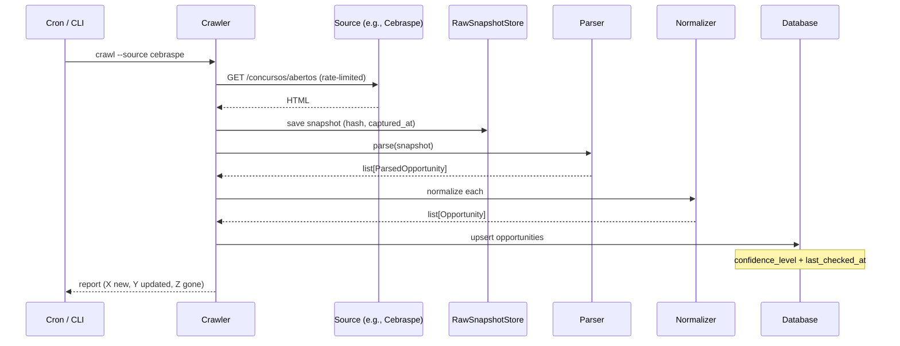
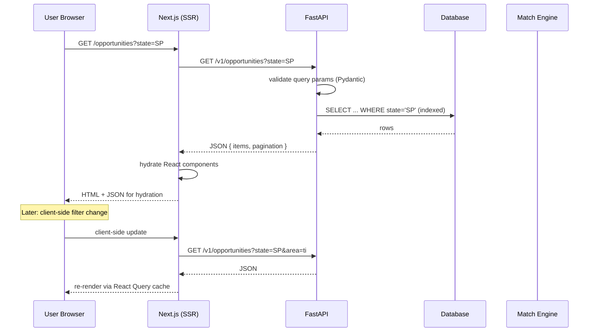
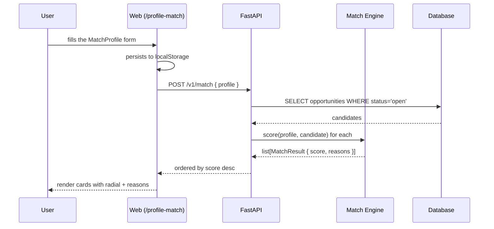
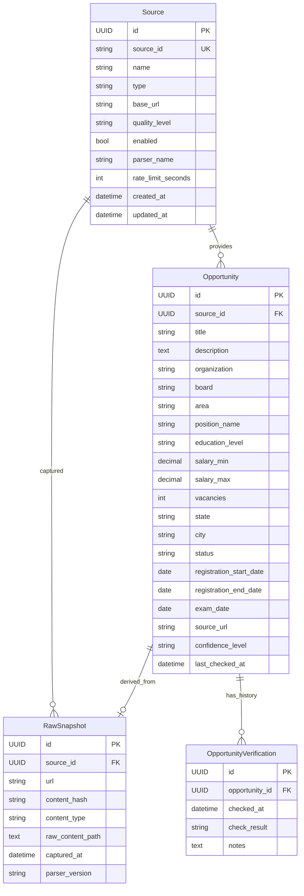
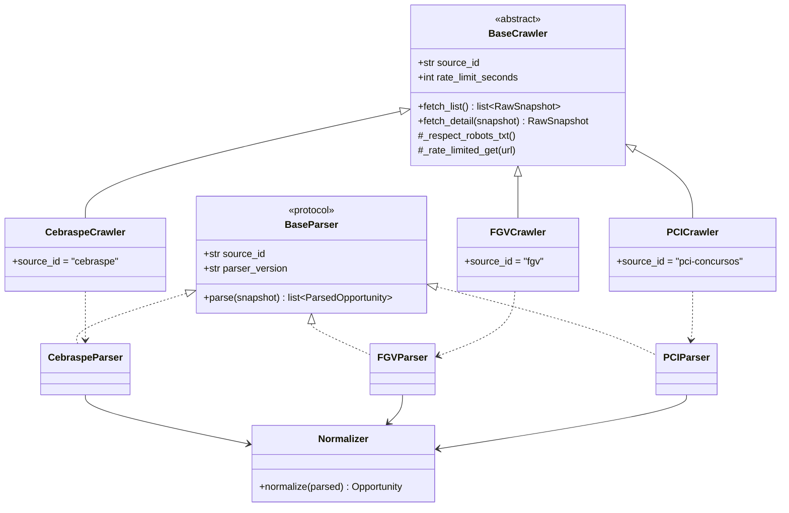
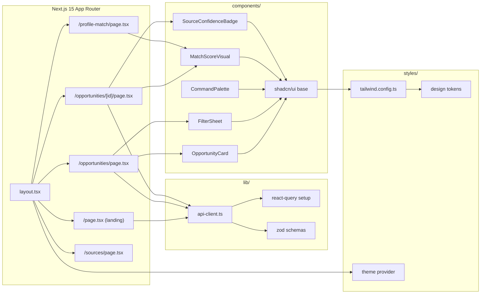
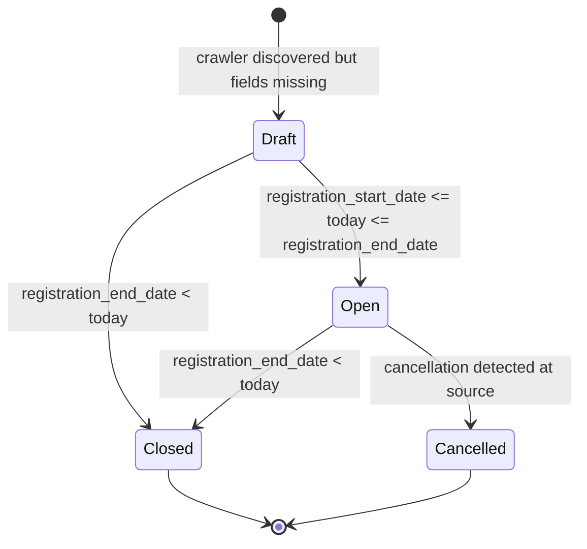
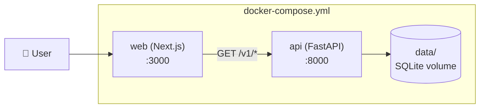

# Architecture

> Data flow diagrams and architectural decisions for CivicRadar.

For technical principles and an overall view, see [`TECH_FOUNDATION.md`](./TECH_FOUNDATION.md).
For specific decisions, see [`adr/`](./adr/).

---

## 🏛️ Macro view

---

## 🔄 Ingestion flow

**Key points:**
- The crawler **never** writes to the DB directly; it always goes through the normalizer
- Raw snapshots enable **retroactive re-parsing** if the parser improves
- `content_hash` avoids unnecessary re-parsing (skip if unchanged)
- Upsert by `(source_id, source_url)` prevents duplicates

---

## 🌊 Request flow (API)

---

## 🎯 Match flow

**Characteristics:**
- **Stateless** — Profile is not persisted server-side
- **Deterministic** — Same input → same output
- **Explainable** — Every score comes with a breakdown
- **Limited** — Only considers `status='open'` (active openings)

---

## 📊 Data model

---

## 🧩 Plugin architecture (crawlers)

For implementation details, see [`DATA_SOURCES.md`](./DATA_SOURCES.md).

---

## 🎨 Frontend architecture

---

## 🚦 Opportunity states

---

## 📦 Container architecture (Docker Compose)

In **production**, this architecture expands with:
- Reverse proxy (Caddy / Nginx)
- Standalone Postgres
- Redis for cache
- Crawler worker in its own container

---

## 🔗 Links

- [`PRODUCT_FOUNDATION.md`](./PRODUCT_FOUNDATION.md) — Vision, scope, principles
- [`TECH_FOUNDATION.md`](./TECH_FOUNDATION.md) — Stack, contracts, testing
- [`DATA_SOURCES.md`](./DATA_SOURCES.md) — Adding new sources
- [`API.md`](./API.md) — Endpoint reference
- [`adr/`](./adr/) — Specific architecture decisions
