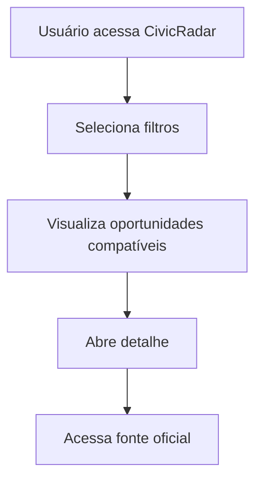
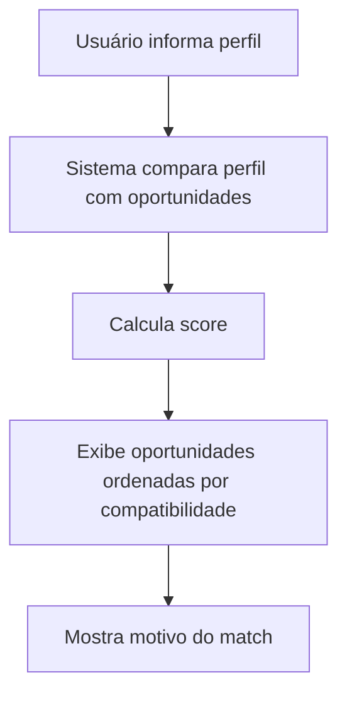
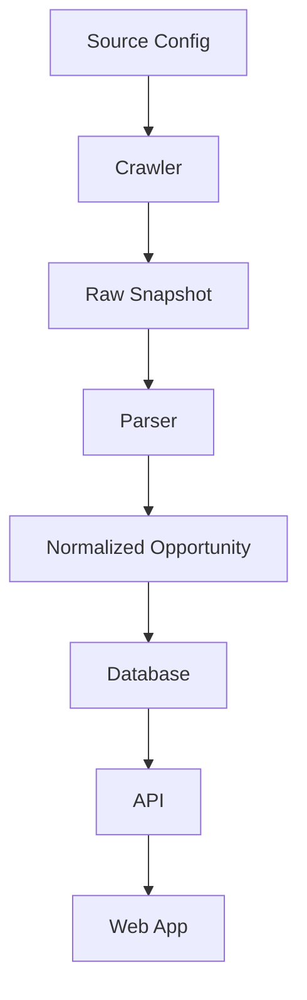
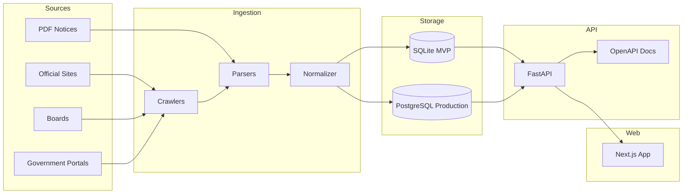

# PRODUCT_FOUNDATION.md

# CivicRadar — Product Foundation

> **Open source radar for Brazilian public career opportunities.**  
> Encontre, filtre e acompanhe concursos públicos brasileiros compatíveis com o seu perfil.

---

## 1. Product Summary

**CivicRadar** é uma aplicação open source para monitorar, organizar, filtrar e recomendar concursos públicos brasileiros com base em área de interesse, localização, escolaridade, salário, cargo e palavras-chave.

O produto nasce como uma ferramenta de **civic tech**: seu objetivo é facilitar o acesso a informações públicas espalhadas em diferentes fontes, sem substituir os canais oficiais.

A aplicação deve sempre priorizar:

- transparência;
- rastreabilidade da fonte;
- respeito às fontes oficiais;
- baixo custo de operação;
- facilidade de contribuição open source;
- utilidade real para quem busca uma oportunidade pública.

---

## 2. Repository Identity

| Item | Definição |
|---|---|
| Product Name | CivicRadar |
| Repository Name | `civic-radar` |
| Product Type | Open Source Civic Tech |
| Core Language | Python |
| Backend | FastAPI |
| Frontend | Next.js + TypeScript |
| Database MVP | SQLite |
| Database Production | PostgreSQL |
| License Recommendation | AGPL-3.0 |
| Main Audience | Pessoas buscando concursos públicos no Brasil |
| Secondary Audience | Desenvolvedores, pesquisadores, civic hackers e comunidades open data |

---

## 3. Vision

Criar uma plataforma aberta que ajude pessoas a descobrir oportunidades públicas relevantes no Brasil sem depender de busca manual repetitiva em múltiplos sites, PDFs, portais de bancas e páginas institucionais.

O CivicRadar deve funcionar como uma camada de inteligência sobre informações públicas:

```txt
Fontes públicas + normalização + filtros + match por perfil + alertas
```

A visão de longo prazo é transformar dados fragmentados de concursos públicos em uma base pesquisável, auditável e útil para a sociedade.

---

## 4. Problem Statement

Informações sobre concursos públicos no Brasil são altamente fragmentadas.

Elas podem estar em:

- sites de bancas organizadoras;
- portais de prefeituras;
- páginas de órgãos estaduais;
- portais federais;
- PDFs de editais;
- notícias;
- agregadores privados;
- páginas sem padrão técnico;
- documentos antigos sem atualização clara.

Para o usuário final, isso gera vários problemas:

1. **Busca manual cansativa**  
   A pessoa precisa visitar vários sites repetidamente.

2. **Baixa clareza**  
   Editais são longos, técnicos e difíceis de comparar.

3. **Perda de prazo**  
   Inscrições podem abrir e fechar sem que o candidato perceba.

4. **Falta de personalização**  
   A maioria dos sites lista tudo, mas não responde:  
   “quais oportunidades realmente servem para mim?”

5. **Fragmentação de fontes**  
   Cada banca, prefeitura ou órgão publica de uma forma diferente.

6. **Dificuldade de auditoria**  
   Muitos agregadores não deixam claro quando a informação foi checada, qual é a fonte original e se há risco de desatualização.

---

## 5. Product Opportunity

O CivicRadar pode se diferenciar por ser:

- open source;
- transparente;
- focado em rastreabilidade;
- orientado a fontes oficiais;
- extensível por contribuidores;
- simples de rodar localmente;
- útil tanto para usuários finais quanto para desenvolvedores.

O diferencial não é apenas listar concursos.

O diferencial é:

> Transformar informações públicas desorganizadas em oportunidades filtráveis, rastreáveis e compreensíveis.

---

## 6. Product Principles

### 6.1 Official Sources First

Sempre que possível, o CivicRadar deve priorizar fontes oficiais:

- páginas da banca;
- páginas do órgão;
- diários oficiais;
- páginas de prefeitura;
- portais públicos.

Agregadores podem ser usados como fonte complementar, mas não devem ser tratados como fonte final de verdade.

---

### 6.2 Do Not Replace the Official Source

O CivicRadar não substitui edital, banca, órgão ou portal oficial.

A aplicação deve sempre exibir:

- link da fonte original;
- data da última verificação;
- status da oportunidade;
- nível de confiança da fonte;
- aviso de que o usuário deve confirmar informações no canal oficial.

---

### 6.3 Open Data Mindset

O projeto deve tratar informação pública com responsabilidade.

O objetivo é melhorar acesso, organização e descoberta, não capturar, vender ou esconder dados públicos.

---

### 6.4 Low Infrastructure Dependency

O MVP deve ser simples de rodar localmente:

```bash
git clone
docker compose up
```

A primeira versão deve evitar dependências complexas de cloud, filas pesadas ou integrações pagas.

---

### 6.5 Contribution-Friendly

O projeto deve ser fácil para outros desenvolvedores contribuírem.

Isso exige:

- documentação clara;
- issues bem definidas;
- exemplos de fontes;
- testes para crawlers/parsers;
- fixtures de HTML/PDF;
- arquitetura modular;
- guia de contribuição.

---

## 7. Target Users

### 7.1 Primary Persona — Candidate

Pessoa que busca concursos públicos e quer acompanhar oportunidades compatíveis com seu perfil.

**Necessidades:**

- encontrar concursos relevantes;
- filtrar por área;
- filtrar por localidade;
- saber prazo de inscrição;
- receber alertas;
- acessar fonte oficial;
- entender rapidamente se vale a pena ler o edital.

**Exemplo:**

```txt
Quero concursos de TI no Brasil, preferencialmente remotos ou em SP/RJ/PR,
com salário acima de R$ 6.000 e nível superior.
```

---

### 7.2 Secondary Persona — Contributor

Desenvolvedor ou civic hacker interessado em melhorar acesso a informações públicas.

**Necessidades:**

- adicionar novas fontes;
- melhorar parser de edital;
- criar testes;
- corrigir bugs;
- melhorar documentação;
- reaproveitar API aberta.

---

### 7.3 Tertiary Persona — Researcher / Journalist

Pessoa interessada em analisar dados públicos de concursos.

**Necessidades:**

- ver histórico;
- consultar oportunidades por órgão;
- analisar padrões por estado;
- verificar fontes;
- exportar dados.

Essa persona não é foco do MVP, mas pode guiar decisões futuras.

---

## 8. Value Proposition

### Main Value Proposition

> CivicRadar helps people find, filter and track Brazilian public tenders that match their profile.

### PT-BR

> O CivicRadar ajuda pessoas a encontrar, filtrar e acompanhar concursos públicos brasileiros compatíveis com seu perfil.

### Open Source Positioning

> Open source intelligence for Brazilian public career opportunities.

### PT-BR

> Inteligência aberta para acompanhar oportunidades de carreira pública no Brasil.

---

## 9. MVP Scope

O MVP deve ser pequeno, útil e validável.

### 9.1 MVP Goal

Criar uma versão funcional que:

1. coleta oportunidades de fontes configuradas;
2. normaliza os dados principais;
3. armazena em banco local;
4. expõe API pública;
5. exibe interface web com filtros;
6. mostra link para a fonte original;
7. calcula um match básico com base no perfil do usuário.

---

## 10. MVP Features

### 10.1 Opportunity Listing

Listar concursos/oportunidades com os campos principais:

- título;
- órgão;
- banca;
- cargo;
- área;
- estado;
- cidade;
- escolaridade;
- salário mínimo;
- salário máximo;
- status;
- data de abertura de inscrição;
- data final de inscrição;
- data de prova, quando disponível;
- link da fonte;
- data da última verificação.

---

### 10.2 Filters

Filtros iniciais:

- área de interesse;
- estado;
- cidade;
- escolaridade;
- salário mínimo;
- status;
- banca;
- órgão;
- palavra-chave.

---

### 10.3 Opportunity Detail Page

Página de detalhe com:

- resumo da oportunidade;
- dados normalizados;
- fonte original;
- status;
- histórico mínimo de verificação;
- aviso de conferência oficial.

---

### 10.4 Basic Profile Match

O usuário poderá informar um perfil simples:

```json
{
  "areas": ["Tecnologia", "Administração"],
  "states": ["SP", "RJ", "PR"],
  "education_level": "superior",
  "minimum_salary": 6000,
  "keywords": ["analista de sistemas", "desenvolvedor", "tecnologia"]
}
```

O sistema retorna um score de compatibilidade.

Exemplo:

```txt
Match: 87%
Motivo: área compatível, salário acima do mínimo, inscrições abertas e cargo relacionado a tecnologia.
```

---

### 10.5 Source Traceability

Toda oportunidade deve conter:

- `source_name`;
- `source_url`;
- `original_url`;
- `last_checked_at`;
- `confidence_level`;
- `parser_version`.

---

### 10.6 Basic Admin/Developer CLI

O MVP pode ter uma CLI simples para desenvolvimento:

```bash
python -m civic_radar crawl --source cebraspe
python -m civic_radar parse --fixture sample.html
python -m civic_radar seed
python -m civic_radar export --format json
```

---

## 11. Out of Scope for MVP

Não implementar no MVP:

- login obrigatório;
- pagamento;
- plano premium;
- IA generativa;
- parsing perfeito de todos os editais;
- app mobile nativo;
- alertas por WhatsApp;
- sistema complexo de permissões;
- crawling massivo sem controle;
- scraping agressivo;
- armazenamento integral de PDFs de terceiros;
- painel administrativo completo.

Esses pontos podem entrar em versões futuras.

---

## 12. Product Boundaries

O CivicRadar deve ser cuidadoso com o que ele promete.

### 12.1 The Product Is

- um radar;
- um indexador;
- um normalizador;
- uma ferramenta de descoberta;
- uma camada de filtros e match;
- um projeto open source de utilidade pública.

### 12.2 The Product Is Not

- uma fonte oficial;
- uma banca organizadora;
- um substituto do edital;
- um serviço jurídico;
- uma garantia de inscrição;
- uma garantia de aprovação;
- um agregador comercial fechado.

---

## 13. Core User Journeys

### 13.1 Discover Opportunities



---

### 13.2 Match by Profile



---

### 13.3 Data Ingestion



---

## 14. Data Source Strategy

### 14.1 Source Types

| Source Type | Priority | Notes |
|---|---:|---|
| Official agency pages | High | Preferencial |
| Organizing boards | High | Ex: Cebraspe, FGV, FCC, Vunesp |
| Official government portals | High | Quando disponíveis |
| Municipal websites | Medium | Difícil padronização |
| Public notices / official gazettes | Medium | Alto valor, parsing mais difícil |
| Aggregator sites | Low/Medium | Complementares, não fonte final |

---

### 14.2 Source Quality Levels

| Level | Meaning |
|---|---|
| High | Fonte oficial ou banca organizadora |
| Medium | Portal público institucional, mas sem padrão claro |
| Low | Agregador ou página sem rastreabilidade forte |

---

### 14.3 Source Metadata

Cada fonte deve ser descrita por um arquivo de configuração:

```yaml
id: cebraspe
name: Cebraspe
type: organizing_board
base_url: https://www.cebraspe.org.br/concursos/
enabled: true
robots_policy_required: true
rate_limit_seconds: 10
parser: cebraspe_v1
quality_level: high
```

---

## 15. Matching Logic

O MVP deve começar com scoring determinístico e simples.

### 15.1 Suggested Score Weights

| Criteria | Weight |
|---|---:|
| Area match | 30 |
| Keyword match | 20 |
| Location match | 15 |
| Education level match | 15 |
| Salary match | 10 |
| Status/date relevance | 10 |

Total: 100 points.

---

### 15.2 Match Output

```json
{
  "opportunity_id": "uuid",
  "score": 87,
  "reasons": [
    "Área compatível com Tecnologia",
    "Cargo contém palavra-chave: analista de sistemas",
    "Salário acima do mínimo informado",
    "Inscrições abertas"
  ]
}
```

---

## 16. Information Architecture

### 16.1 Main Pages

| Page | Description |
|---|---|
| `/` | Landing page + search |
| `/opportunities` | Listagem com filtros |
| `/opportunities/[id]` | Detalhe da oportunidade |
| `/profile-match` | Match com perfil local |
| `/sources` | Fontes monitoradas |
| `/about` | Sobre o projeto open source |
| `/contribute` | Como contribuir |

---

### 16.2 API Resources

| Resource | Description |
|---|---|
| `/health` | Healthcheck |
| `/opportunities` | Lista oportunidades |
| `/opportunities/{id}` | Detalhe |
| `/sources` | Lista fontes |
| `/match` | Calcula compatibilidade |
| `/stats` | Estatísticas públicas |

---

## 17. Suggested Tech Stack

### 17.1 Backend

```txt
Python
FastAPI
SQLAlchemy
Pydantic
Alembic
SQLite for MVP
PostgreSQL for production
```

### 17.2 Crawling and Parsing

```txt
httpx
BeautifulSoup
selectolax
pypdf
pdfplumber
Playwright only when strictly necessary
```

### 17.3 Frontend

```txt
Next.js
TypeScript
Tailwind CSS
React Query or TanStack Query
Zod
```

### 17.4 Tooling

```txt
Docker
Docker Compose
Ruff
Pytest
Mypy
ESLint
Prettier
GitHub Actions
```

### 17.5 API Documentation

The project should follow a contract-first mindset.

- OpenAPI should be exposed by FastAPI.
- API docs should be available locally.
- Future API reference can use Scalar or Swagger UI.

---

## 18. Proposed Architecture



---

## 19. Suggested Monorepo Structure

```txt
civic-radar/
├── apps/
│   ├── api/
│   └── web/
├── packages/
│   ├── shared-types/
│   └── schemas/
├── crawlers/
│   ├── sources/
│   ├── parsers/
│   ├── normalizers/
│   └── fixtures/
├── data/
│   ├── samples/
│   └── exports/
├── docs/
│   ├── PRODUCT_FOUNDATION.md
│   ├── TECH_FOUNDATION.md
│   ├── DATA_SOURCES.md
│   ├── CONTRIBUTING.md
│   ├── ROADMAP.md
│   └── GOVERNANCE.md
├── docker-compose.yml
├── README.md
├── LICENSE
└── .github/
    ├── workflows/
    └── ISSUE_TEMPLATE/
```

---

## 20. Data Model Draft

### 20.1 Opportunity

```txt
Opportunity
- id
- title
- description
- organization
- board
- area
- position_name
- education_level
- salary_min
- salary_max
- vacancies
- state
- city
- status
- registration_start_date
- registration_end_date
- exam_date
- source_id
- source_url
- original_url
- confidence_level
- last_checked_at
- created_at
- updated_at
```

---

### 20.2 Source

```txt
Source
- id
- name
- type
- base_url
- quality_level
- enabled
- parser_name
- rate_limit_seconds
- last_successful_check_at
- last_error_at
- created_at
- updated_at
```

---

### 20.3 Raw Snapshot

```txt
RawSnapshot
- id
- source_id
- url
- content_hash
- content_type
- raw_content_path
- captured_at
- parser_version
```

---

### 20.4 Match Profile

For MVP, this can be local-only and not persisted.

```txt
MatchProfile
- areas
- states
- cities
- education_level
- minimum_salary
- keywords
```

---

## 21. Open Source Strategy

### 21.1 Recommended License

Recommended:

```txt
AGPL-3.0
```

Reason:

- protects the open nature of the project;
- discourages closed SaaS forks without contribution;
- keeps improvements available to the community.

Alternative:

```txt
Apache-2.0
```

Use Apache-2.0 if the goal becomes maximum adoption by companies and institutions.

---

### 21.2 Required Open Source Files

The repository should include:

```txt
README.md
LICENSE
CONTRIBUTING.md
CODE_OF_CONDUCT.md
SECURITY.md
ROADMAP.md
DATA_SOURCES.md
GOVERNANCE.md
```

---

### 21.3 Contribution Areas

Good first contribution areas:

- add a new source;
- fix parser;
- improve UI;
- add tests;
- improve documentation;
- add fixtures;
- improve accessibility;
- translate UI;
- improve source quality scoring.

---

### 21.4 Issue Labels

Suggested labels:

```txt
good first issue
help wanted
source
parser
frontend
backend
documentation
bug
enhancement
legal-review
data-quality
accessibility
performance
```

---

## 22. Legal and Ethical Guardrails

The CivicRadar should follow these rules:

1. Always link to the original source.
2. Do not claim to be an official source.
3. Do not store unnecessary personal data.
4. Do not aggressively crawl websites.
5. Respect robots.txt and source terms when applicable.
6. Do not republish full copyrighted content when not necessary.
7. Store metadata and summaries, not full third-party pages as public content.
8. Make source freshness visible.
9. Make parser confidence visible.
10. Add disclaimers telling users to verify information officially.

---

## 23. Privacy Approach

The MVP should avoid user accounts.

Recommended MVP behavior:

- profile matching runs locally or with temporary request payload;
- no personal data required;
- no tracking by default;
- no analytics unless explicitly configured;
- no cookies unless needed;
- no email alerts in the first version unless self-hosted.

Future user accounts should be optional.

---

## 24. Success Metrics

### 24.1 Product Metrics

| Metric | Target for MVP |
|---|---:|
| Number of sources supported | 3 to 5 |
| Opportunities indexed | 50+ |
| Filter response time | < 500ms local |
| API response time | < 300ms for common queries |
| Match explanation coverage | 100% of match results |
| Source traceability | 100% of opportunities |

---

### 24.2 Open Source Metrics

| Metric | Target |
|---|---:|
| Clear README | Yes |
| Good first issues | 5+ |
| Setup time | < 10 minutes |
| Test coverage for parsers | Basic |
| Docker Compose working | Yes |
| Contribution guide | Yes |

---

## 25. MVP Acceptance Criteria

The MVP is considered successful when:

- a developer can run the project locally using Docker Compose;
- at least 3 sources are configured;
- opportunities are stored in SQLite;
- API exposes opportunities with filters;
- frontend lists opportunities;
- details page links to source original;
- match endpoint returns score and reasons;
- README explains setup and project purpose;
- license is included;
- contribution guide exists.

---

## 26. Roadmap

### Milestone 0 — Foundation

- Product foundation document
- Technical foundation document
- README
- License
- Contribution guide
- Data source strategy
- Initial architecture

---

### Milestone 1 — Ingestion MVP

- Source config format
- Crawler base
- Parser interface
- Raw snapshots
- Normalized opportunities
- SQLite persistence
- Initial tests

---

### Milestone 2 — API MVP

- FastAPI project
- OpenAPI docs
- `/health`
- `/opportunities`
- `/opportunities/{id}`
- `/sources`
- Filtering
- Pagination

---

### Milestone 3 — Web MVP

- Landing page
- Opportunities list
- Filters
- Opportunity detail
- Source traceability UI
- Responsive layout
- Accessibility baseline

---

### Milestone 4 — Match Engine

- Local profile form
- Match score
- Match reasons
- Sort by compatibility
- Explainability UI

---

### Milestone 5 — Alerts

- RSS feed
- Webhook support
- Email optional
- Telegram/Discord optional
- User-defined saved searches

---

### Milestone 6 — Intelligence Layer

- Edital summarization
- Requirement extraction
- Deadline warnings
- Study-plan suggestions
- Historical data analysis

---

## 27. Key Risks

### 27.1 Data Fragmentation

Different sources have different structures.

**Mitigation:**

- source-specific parsers;
- fixtures;
- parser versioning;
- confidence levels.

---

### 27.2 Legal / Terms Risk

Some sources may not allow scraping or may restrict usage.

**Mitigation:**

- prefer official pages;
- respect robots.txt;
- use rate limits;
- store metadata only;
- link back to source;
- avoid republication of full content.

---

### 27.3 Data Staleness

Concursos can change status, dates or links.

**Mitigation:**

- show `last_checked_at`;
- recrawl scheduled sources;
- mark stale data;
- allow community reports.

---

### 27.4 Parser Breakage

Sites can change layout.

**Mitigation:**

- automated tests with fixtures;
- monitoring parser failures;
- parser versioning;
- clear source status dashboard.

---

### 27.5 Overengineering

The project could become too complex before proving value.

**Mitigation:**

- SQLite first;
- no login in MVP;
- no AI in MVP;
- limited sources;
- simple deterministic scoring.

---

## 28. Future Opportunities

Potential future features:

- public API;
- hosted version;
- alerts by email;
- saved searches;
- browser notifications;
- edital diff;
- study plan generator;
- calendar export;
- historical salary analytics;
- regional dashboards;
- community source submissions;
- integration with official gazettes;
- semantic search over edital content;
- AI-based summary with clear disclaimers.

---

## 29. Brand Direction

### 29.1 Name

```txt
CivicRadar
```

### 29.2 Repository

```txt
civic-radar
```

### 29.3 Taglines

```txt
Open source radar for Brazilian public career opportunities.
```

```txt
Find, filter and track Brazilian public tenders that match your profile.
```

```txt
Inteligência aberta para acompanhar oportunidades de carreira pública no Brasil.
```

---

## 30. Recommended First Build Sequence

1. Create repository.
2. Add README, LICENSE, CONTRIBUTING and this product foundation.
3. Create FastAPI skeleton.
4. Add SQLite models.
5. Create source config structure.
6. Implement first crawler.
7. Save normalized opportunities.
8. Expose `/opportunities`.
9. Build web list with filters.
10. Add match scoring.
11. Add tests.
12. Publish MVP roadmap issues.

---

## 31. Product Decision Log

| Date | Decision | Reason |
|---|---|---|
| TBD | Use `CivicRadar` as product name | Short, English, civic-tech friendly and expandable |
| TBD | Use Python + FastAPI | Strong fit for crawling, parsing and API |
| TBD | Use SQLite for MVP | Easy local setup for open source contributors |
| TBD | Use AGPL-3.0 | Protects open source nature in hosted/SaaS scenarios |
| TBD | Avoid login in MVP | Reduces complexity and privacy surface |
| TBD | Avoid AI in MVP | Focus on reliable data foundation first |

---

## 32. Final Product Definition

**CivicRadar** is an open source platform that monitors, normalizes and recommends Brazilian public tender opportunities based on user interests, always preserving traceability to official sources.

In PT-BR:

**CivicRadar** é uma plataforma open source que monitora, normaliza e recomenda concursos públicos brasileiros com base no perfil do usuário, sempre preservando rastreabilidade para as fontes oficiais.

---

## 33. Next Recommended Document

After this file, create:

```txt
TECH_FOUNDATION.md
```

It should define:

- backend architecture;
- crawler architecture;
- parser contracts;
- database schema;
- API contract;
- frontend architecture;
- testing strategy;
- deployment strategy;
- observability;
- security baseline.
