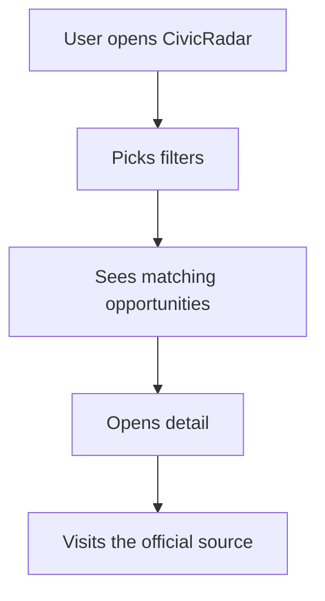
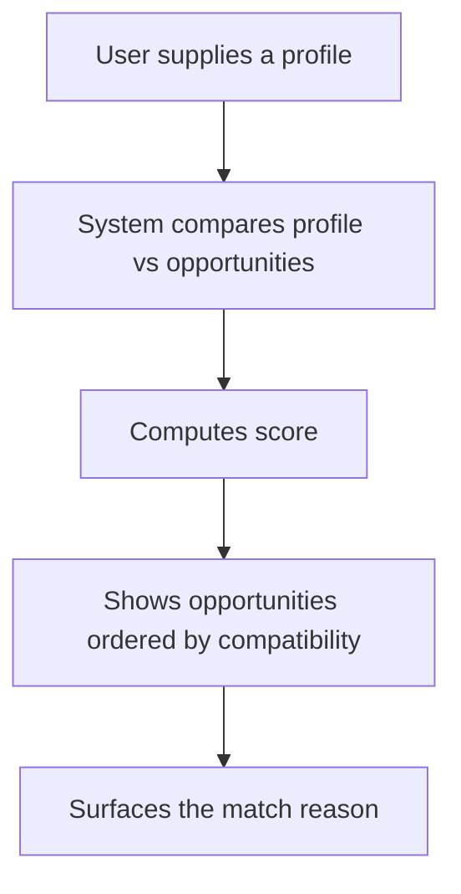
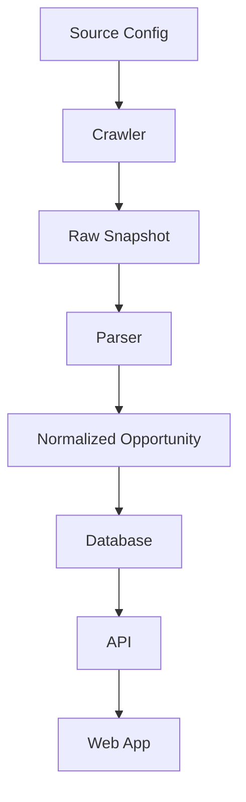
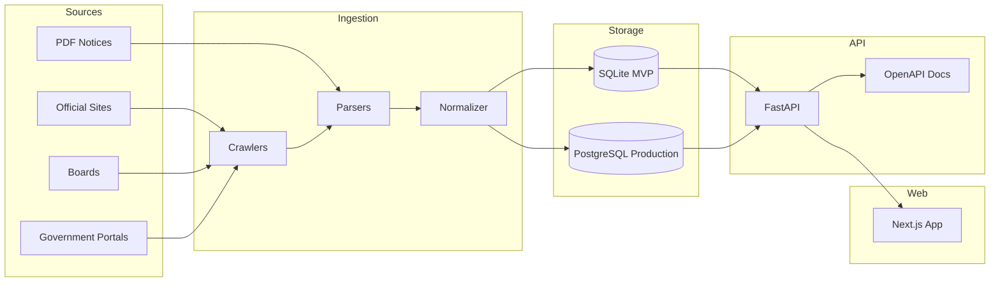

# PRODUCT_FOUNDATION.md

# CivicRadar — Product Foundation

> **Open source radar for Brazilian public career opportunities.**
> Find, filter and track Brazilian public tenders that match your profile.

---

## 1. Product Summary

**CivicRadar** is an open source application to monitor, organize, filter and recommend Brazilian public tenders based on area of interest, location, education, salary, position and keywords.

The product is born as a **civic-tech** tool: its goal is to make public information scattered across many sources easier to access, without replacing the official channels.

The application must always prioritize:

- transparency;
- source traceability;
- respect for official sources;
- low operating cost;
- ease of open source contribution;
- real-world usefulness for someone hunting a public opportunity.

---

## 2. Repository Identity

| Item | Definition |
|---|---|
| Product Name | CivicRadar |
| Repository Name | `civic-radar` |
| Product Type | Open Source Civic Tech |
| Core Language | Python |
| Backend | FastAPI |
| Frontend | Next.js + TypeScript |
| Database (MVP) | SQLite |
| Database (Production) | PostgreSQL |
| License Recommendation | AGPL-3.0 |
| Primary Audience | People hunting Brazilian public tenders |
| Secondary Audience | Developers, researchers, civic hackers and open data communities |

---

## 3. Vision

Create an open platform that helps people discover relevant public opportunities in Brazil without relying on repetitive manual searches across many sites, PDFs, board portals and institutional pages.

CivicRadar should work as an intelligence layer on top of public information:

```txt
Public sources + normalization + filters + profile match + alerts
```

The long-term vision is to turn fragmented Brazilian public-tender data into a searchable, auditable and useful base for society.

---

## 4. Problem Statement

Information about Brazilian public tenders is highly fragmented.

It can live in:

- organizing-board sites;
- city-hall portals;
- state agency pages;
- federal portals;
- edital PDFs;
- news articles;
- private aggregators;
- pages without any technical standard;
- old documents without clear updates.

For the end user this creates several problems:

1. **Exhausting manual hunting**
   The person has to visit many sites repeatedly.

2. **Low clarity**
   Editais are long, technical and hard to compare.

3. **Missed deadlines**
   Registrations can open and close without the candidate noticing.

4. **Lack of personalization**
   Most sites list everything, but never answer:
   "which opportunities actually fit me?"

5. **Source fragmentation**
   Each board, city hall or agency publishes in a different way.

6. **Hard to audit**
   Many aggregators do not make it clear when the information was checked, what the original source is or whether it might be stale.

---

## 5. Product Opportunity

CivicRadar can stand out by being:

- open source;
- transparent;
- traceability-driven;
- biased toward official sources;
- extensible by contributors;
- simple to run locally;
- useful for both end users and developers.

The differentiator is not just listing tenders.

The differentiator is:

> Turning disorganized public information into filterable, traceable and understandable opportunities.

---

## 6. Product Principles

### 6.1 Official Sources First

Whenever possible, CivicRadar must prioritize official sources:

- board pages;
- agency pages;
- official gazettes;
- city-hall pages;
- public portals.

Aggregators can be used as complementary sources, but never as the final source of truth.

---

### 6.2 Do Not Replace the Official Source

CivicRadar does not replace an edital, board, agency or official portal.

The application must always display:

- the original source link;
- the date of the last verification;
- the opportunity status;
- the source confidence level;
- a notice telling the user to confirm the information on the official channel.

---

### 6.3 Open Data Mindset

The project must treat public information with responsibility.

The goal is to improve access, organization and discovery — not to capture, sell or hide public data.

---

### 6.4 Low Infrastructure Dependency

The MVP must be simple to run locally:

```bash
git clone
docker compose up
```

The first release must avoid complex cloud dependencies, heavy queues or paid integrations.

---

### 6.5 Contribution-Friendly

The project must be easy for other developers to contribute to.

That requires:

- clear documentation;
- well-defined issues;
- source examples;
- tests for crawlers/parsers;
- HTML/PDF fixtures;
- modular architecture;
- a contribution guide.

---

## 7. Target Users

### 7.1 Primary Persona — Candidate

A person hunting Brazilian public tenders who wants to track opportunities matching their profile.

**Needs:**

- find relevant tenders;
- filter by area;
- filter by location;
- know the registration deadline;
- receive alerts;
- reach the official source;
- quickly understand whether it is worth reading the edital.

**Example:**

```txt
I want IT tenders in Brazil, preferably remote or in SP/RJ/PR,
with a salary above R$ 6,000 and superior education.
```

---

### 7.2 Secondary Persona — Contributor

A developer or civic hacker interested in improving access to public information.

**Needs:**

- add new sources;
- improve the edital parser;
- write tests;
- fix bugs;
- improve documentation;
- reuse the open API.

---

### 7.3 Tertiary Persona — Researcher / Journalist

A person interested in analyzing public tender data.

**Needs:**

- view history;
- query opportunities per agency;
- analyze patterns per state;
- verify sources;
- export data.

This persona is not the MVP focus, but it can guide future decisions.

---

## 8. Value Proposition

### Main Value Proposition

> CivicRadar helps people find, filter and track Brazilian public tenders that match their profile.

### Open Source Positioning

> Open source intelligence for Brazilian public career opportunities.

---

## 9. MVP Scope

The MVP must be small, useful and provable.

### 9.1 MVP Goal

Build a functional version that:

1. collects opportunities from configured sources;
2. normalizes the main fields;
3. stores them in a local database;
4. exposes a public API;
5. shows a web interface with filters;
6. links to the original source;
7. computes a basic match against a user profile.

---

## 10. MVP Features

### 10.1 Opportunity Listing

List tenders / opportunities with the main fields:

- title;
- organization;
- board;
- position;
- area;
- state;
- city;
- education level;
- minimum salary;
- maximum salary;
- status;
- registration start date;
- registration end date;
- exam date, when available;
- source link;
- date of the last verification.

---

### 10.2 Filters

Initial filters:

- area of interest;
- state;
- city;
- education level;
- minimum salary;
- status;
- board;
- agency;
- keyword.

---

### 10.3 Opportunity Detail Page

Detail page with:

- opportunity summary;
- normalized fields;
- original source;
- status;
- minimal verification history;
- official-confirmation notice.

---

### 10.4 Basic Profile Match

The user can supply a simple profile:

```json
{
  "areas": ["Tecnologia", "Administração"],
  "states": ["SP", "RJ", "PR"],
  "education_level": "superior",
  "minimum_salary": 6000,
  "keywords": ["analista de sistemas", "desenvolvedor", "tecnologia"]
}
```

The system returns a compatibility score.

Example:

```txt
Match: 87%
Reason: matching area, salary above the minimum, registration open, and IT-related role.
```

---

### 10.5 Source Traceability

Every opportunity must include:

- `source_name`;
- `source_url`;
- `original_url`;
- `last_checked_at`;
- `confidence_level`;
- `parser_version`.

---

### 10.6 Basic Admin/Developer CLI

The MVP can ship with a simple developer CLI:

```bash
python -m civic_radar crawl --source cebraspe
python -m civic_radar parse --fixture sample.html
python -m civic_radar seed
python -m civic_radar export --format json
```

---

## 11. Out of Scope for MVP

Not in the MVP:

- mandatory login;
- payments;
- premium plan;
- generative AI;
- perfect parsing of every edital;
- a native mobile app;
- WhatsApp alerts;
- complex permission system;
- massive uncontrolled crawling;
- aggressive scraping;
- full storage of third-party PDFs;
- a complete admin dashboard.

These items can ship in future versions.

---

## 12. Product Boundaries

CivicRadar must be careful with what it promises.

### 12.1 The Product Is

- a radar;
- an indexer;
- a normalizer;
- a discovery tool;
- a filter and match layer;
- an open source project of public interest.

### 12.2 The Product Is Not

- an official source;
- an organizing board;
- a replacement for the edital;
- a legal service;
- a guarantee of registration;
- a guarantee of approval;
- a closed commercial aggregator.

---

## 13. Core User Journeys

### 13.1 Discover Opportunities



---

### 13.2 Match by Profile



---

### 13.3 Data Ingestion



---

## 14. Data Source Strategy

### 14.1 Source Types

| Source Type | Priority | Notes |
|---|---:|---|
| Official agency pages | High | Preferred |
| Organizing boards | High | e.g. Cebraspe, FGV, FCC, Vunesp |
| Official government portals | High | When available |
| Municipal websites | Medium | Hard to standardize |
| Public notices / official gazettes | Medium | High value, harder to parse |
| Aggregator sites | Low/Medium | Complementary, never the final source |

---

### 14.2 Source Quality Levels

| Level | Meaning |
|---|---|
| High | Official source or organizing board |
| Medium | Public institutional portal, no clear standard |
| Low | Aggregator or page with weak traceability |

---

### 14.3 Source Metadata

Each source must be described by a configuration file:

```yaml
id: cebraspe
name: Cebraspe
type: organizing_board
base_url: https://www.cebraspe.org.br/concursos/
enabled: true
robots_policy_required: true
rate_limit_seconds: 10
parser: cebraspe_v1
quality_level: high
```

---

## 15. Matching Logic

The MVP starts with simple deterministic scoring.

### 15.1 Suggested Score Weights

| Criterion | Weight |
|---|---:|
| Area match | 30 |
| Keyword match | 20 |
| Location match | 15 |
| Education level match | 15 |
| Salary match | 10 |
| Status/date relevance | 10 |

Total: 100 points.

---

### 15.2 Match Output

```json
{
  "opportunity_id": "uuid",
  "score": 87,
  "reasons": [
    "Area matches Tecnologia",
    "Position contains the keyword: analista de sistemas",
    "Salary above the minimum",
    "Registrations are open"
  ]
}
```

---

## 16. Information Architecture

### 16.1 Main Pages

| Page | Description |
|---|---|
| `/` | Landing page + search |
| `/opportunities` | List with filters |
| `/opportunities/[id]` | Opportunity detail |
| `/profile-match` | Match against a local profile |
| `/sources` | Monitored sources |
| `/about` | About the open source project |
| `/contribute` | How to contribute |

---

### 16.2 API Resources

| Resource | Description |
|---|---|
| `/health` | Healthcheck |
| `/opportunities` | List opportunities |
| `/opportunities/{id}` | Detail |
| `/sources` | List sources |
| `/match` | Compute compatibility |
| `/stats` | Public statistics |

---

## 17. Suggested Tech Stack

### 17.1 Backend

```txt
Python
FastAPI
SQLAlchemy
Pydantic
Alembic
SQLite for the MVP
PostgreSQL for production
```

### 17.2 Crawling and Parsing

```txt
httpx
BeautifulSoup
selectolax
pypdf
pdfplumber
Playwright only when strictly necessary
```

### 17.3 Frontend

```txt
Next.js
TypeScript
Tailwind CSS
React Query or TanStack Query
Zod
```

### 17.4 Tooling

```txt
Docker
Docker Compose
Ruff
Pytest
Mypy
ESLint
Prettier
GitHub Actions
```

### 17.5 API Documentation

The project follows a contract-first mindset.

- FastAPI exposes the OpenAPI spec.
- The API docs are available locally.
- The future API reference can use Scalar or Swagger UI.

---

## 18. Proposed Architecture



---

## 19. Suggested Monorepo Structure

```txt
civic-radar/
├── apps/
│   ├── api/
│   └── web/
├── packages/
│   ├── shared-types/
│   └── schemas/
├── crawlers/
│   ├── sources/
│   ├── parsers/
│   ├── normalizers/
│   └── fixtures/
├── data/
│   ├── samples/
│   └── exports/
├── docs/
│   ├── PRODUCT_FOUNDATION.md
│   ├── TECH_FOUNDATION.md
│   ├── DATA_SOURCES.md
│   ├── CONTRIBUTING.md
│   ├── ROADMAP.md
│   └── GOVERNANCE.md
├── docker-compose.yml
├── README.md
├── LICENSE
└── .github/
    ├── workflows/
    └── ISSUE_TEMPLATE/
```

---

## 20. Data Model Draft

### 20.1 Opportunity

```txt
Opportunity
- id
- title
- description
- organization
- board
- area
- position_name
- education_level
- salary_min
- salary_max
- vacancies
- state
- city
- status
- registration_start_date
- registration_end_date
- exam_date
- source_id
- source_url
- original_url
- confidence_level
- last_checked_at
- created_at
- updated_at
```

---

### 20.2 Source

```txt
Source
- id
- name
- type
- base_url
- quality_level
- enabled
- parser_name
- rate_limit_seconds
- last_successful_check_at
- last_error_at
- created_at
- updated_at
```

---

### 20.3 Raw Snapshot

```txt
RawSnapshot
- id
- source_id
- url
- content_hash
- content_type
- raw_content_path
- captured_at
- parser_version
```

---

### 20.4 Match Profile

For the MVP this can be local-only and not persisted.

```txt
MatchProfile
- areas
- states
- cities
- education_level
- minimum_salary
- keywords
```

---

## 21. Open Source Strategy

### 21.1 Recommended License

Recommended:

```txt
AGPL-3.0
```

Reason:

- protects the project's open nature;
- discourages closed SaaS forks that do not contribute back;
- keeps improvements available to the community.

Alternative:

```txt
Apache-2.0
```

Use Apache-2.0 if the goal becomes maximum adoption by companies and institutions.

---

### 21.2 Required Open Source Files

The repository should include:

```txt
README.md
LICENSE
CONTRIBUTING.md
CODE_OF_CONDUCT.md
SECURITY.md
ROADMAP.md
DATA_SOURCES.md
GOVERNANCE.md
```

---

### 21.3 Contribution Areas

Good first contribution areas:

- add a new source;
- fix a parser;
- improve the UI;
- add tests;
- improve documentation;
- add fixtures;
- improve accessibility;
- translate the UI;
- improve source quality scoring.

---

### 21.4 Issue Labels

Suggested labels:

```txt
good first issue
help wanted
source
parser
frontend
backend
documentation
bug
enhancement
legal-review
data-quality
accessibility
performance
```

---

## 22. Legal and Ethical Guardrails

CivicRadar must follow these rules:

1. Always link to the original source.
2. Do not claim to be an official source.
3. Do not store unnecessary personal data.
4. Do not crawl aggressively.
5. Respect robots.txt and source terms when applicable.
6. Do not republish full copyrighted content when not necessary.
7. Store metadata and summaries, not full third-party pages as public content.
8. Make source freshness visible.
9. Make parser confidence visible.
10. Add disclaimers telling users to verify information through the official channel.

---

## 23. Privacy Approach

The MVP should avoid user accounts.

Recommended MVP behavior:

- profile matching runs locally or with a temporary request payload;
- no personal data is required;
- no tracking by default;
- no analytics unless explicitly configured;
- no cookies unless needed;
- no email alerts in the first version unless self-hosted.

Future user accounts must be optional.

---

## 24. Success Metrics

### 24.1 Product Metrics

| Metric | MVP Target |
|---|---:|
| Number of sources supported | 3 to 5 |
| Opportunities indexed | 50+ |
| Filter response time | < 500ms local |
| API response time | < 300ms on common queries |
| Match explanation coverage | 100% of match results |
| Source traceability | 100% of opportunities |

---

### 24.2 Open Source Metrics

| Metric | Target |
|---|---:|
| Clear README | Yes |
| Good first issues | 5+ |
| Setup time | < 10 minutes |
| Test coverage for parsers | Basic |
| Docker Compose works | Yes |
| Contribution guide | Yes |

---

## 25. MVP Acceptance Criteria

The MVP is considered successful when:

- a developer can run the project locally using Docker Compose;
- at least 3 sources are configured;
- opportunities are stored in SQLite;
- the API exposes opportunities with filters;
- the frontend lists opportunities;
- the detail page links to the original source;
- the match endpoint returns score and reasons;
- the README explains setup and project purpose;
- the license is included;
- the contribution guide exists.

---

## 26. Roadmap

### Milestone 0 — Foundation

- Product foundation document
- Technical foundation document
- README
- License
- Contribution guide
- Data source strategy
- Initial architecture

---

### Milestone 1 — Ingestion MVP

- Source config format
- Crawler base
- Parser interface
- Raw snapshots
- Normalized opportunities
- SQLite persistence
- Initial tests

---

### Milestone 2 — API MVP

- FastAPI project
- OpenAPI docs
- `/health`
- `/opportunities`
- `/opportunities/{id}`
- `/sources`
- Filtering
- Pagination

---

### Milestone 3 — Web MVP

- Landing page
- Opportunities list
- Filters
- Opportunity detail
- Source traceability UI
- Responsive layout
- Accessibility baseline

---

### Milestone 4 — Match Engine

- Local profile form
- Match score
- Match reasons
- Sort by compatibility
- Explainability UI

---

### Milestone 5 — Alerts

- RSS feed
- Webhook support
- Email optional
- Telegram/Discord optional
- User-defined saved searches

---

### Milestone 6 — Intelligence Layer

- Edital summarization
- Requirement extraction
- Deadline warnings
- Study-plan suggestions
- Historical data analysis

---

## 27. Key Risks

### 27.1 Data Fragmentation

Different sources have different structures.

**Mitigation:**

- source-specific parsers;
- fixtures;
- parser versioning;
- confidence levels.

---

### 27.2 Legal / Terms Risk

Some sources may not allow scraping or may restrict usage.

**Mitigation:**

- prefer official pages;
- respect robots.txt;
- use rate limits;
- store metadata only;
- link back to the source;
- avoid republishing full content.

---

### 27.3 Data Staleness

Tenders can change status, dates or links.

**Mitigation:**

- show `last_checked_at`;
- recrawl scheduled sources;
- mark stale data;
- allow community reports.

---

### 27.4 Parser Breakage

Sites can change layout.

**Mitigation:**

- automated tests with fixtures;
- monitoring parser failures;
- parser versioning;
- a clear source status dashboard.

---

### 27.5 Overengineering

The project could become too complex before proving value.

**Mitigation:**

- SQLite first;
- no login in the MVP;
- no AI in the MVP;
- limited sources;
- simple deterministic scoring.

---

## 28. Future Opportunities

Potential future features:

- public API;
- hosted version;
- email alerts;
- saved searches;
- browser notifications;
- edital diff;
- study plan generator;
- calendar export;
- historical salary analytics;
- regional dashboards;
- community source submissions;
- official-gazette integration;
- semantic search over edital content;
- AI-based summary with clear disclaimers.

---

## 29. Brand Direction

### 29.1 Name

```txt
CivicRadar
```

### 29.2 Repository

```txt
civic-radar
```

### 29.3 Taglines

```txt
Open source radar for Brazilian public career opportunities.
```

```txt
Find, filter and track Brazilian public tenders that match your profile.
```

---

## 30. Recommended First Build Sequence

1. Create the repository.
2. Add README, LICENSE, CONTRIBUTING and this product foundation.
3. Create the FastAPI skeleton.
4. Add the SQLite models.
5. Create the source config structure.
6. Implement the first crawler.
7. Save normalized opportunities.
8. Expose `/opportunities`.
9. Build the web list with filters.
10. Add match scoring.
11. Add tests.
12. Publish MVP roadmap issues.

---

## 31. Product Decision Log

| Date | Decision | Reason |
|---|---|---|
| TBD | Use `CivicRadar` as the product name | Short, English, civic-tech-friendly and expandable |
| TBD | Use Python + FastAPI | Strong fit for crawling, parsing and APIs |
| TBD | Use SQLite for the MVP | Easy local setup for open source contributors |
| TBD | Use AGPL-3.0 | Protects the open source nature in hosted/SaaS scenarios |
| TBD | Avoid login in the MVP | Reduces complexity and privacy surface |
| TBD | Avoid AI in the MVP | Focus on a reliable data foundation first |

---

## 32. Final Product Definition

**CivicRadar** is an open source platform that monitors, normalizes and recommends Brazilian public tender opportunities based on user interests, always preserving traceability to the official sources.

---

## 33. Next Recommended Document

After this file, create:

```txt
TECH_FOUNDATION.md
```

It should define:

- backend architecture;
- crawler architecture;
- parser contracts;
- database schema;
- API contract;
- frontend architecture;
- testing strategy;
- deployment strategy;
- observability;
- security baseline.
