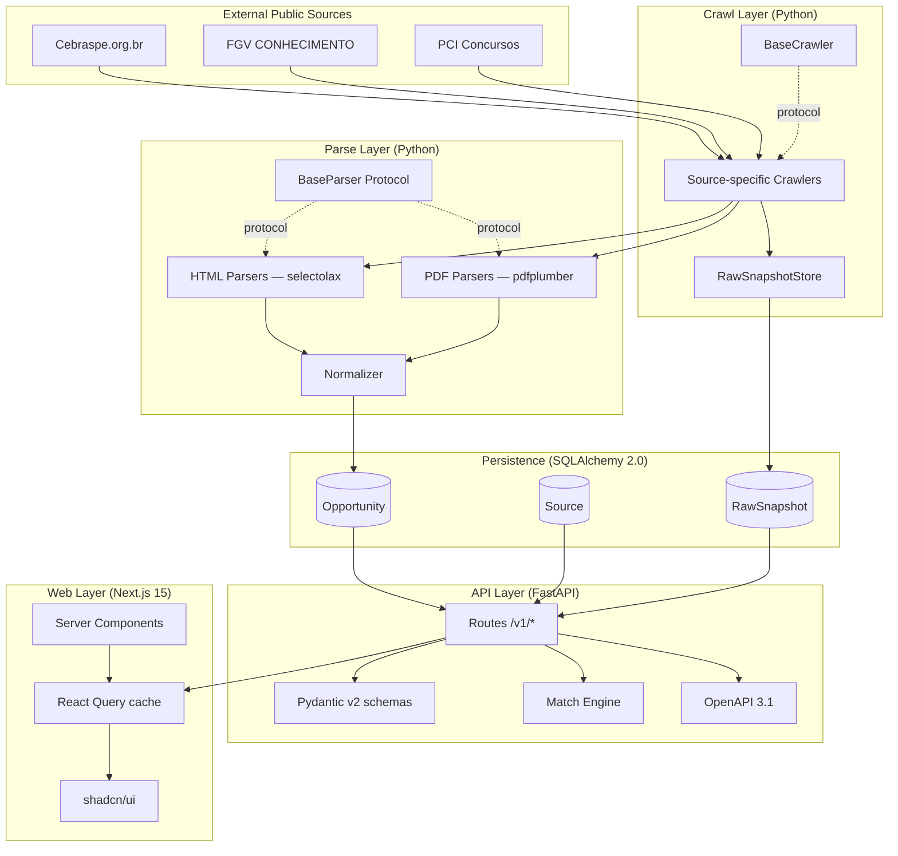
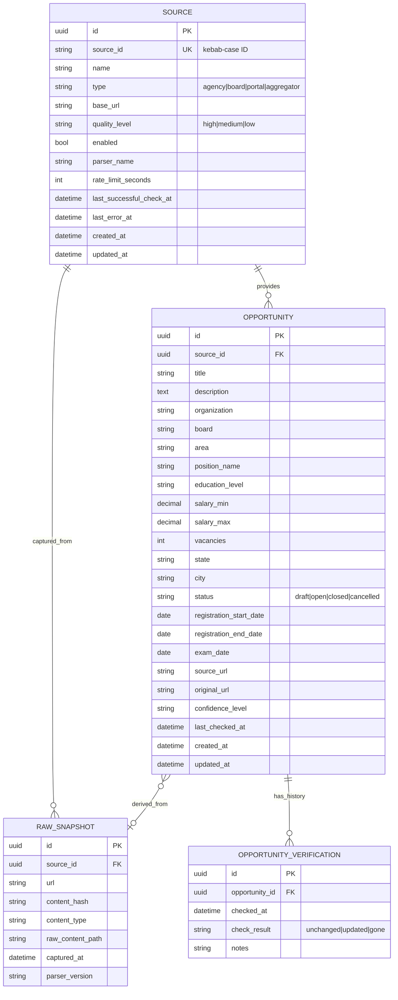

# TECH_FOUNDATION.md

> **Documento técnico complementar ao [`PRODUCT_FOUNDATION.md`](./PRODUCT_FOUNDATION.md).**
> Este arquivo define **como** construímos o CivicRadar — arquitetura, contratos, decisões, padrões.

---

## 1. Princípios Técnicos

1. **Simplicidade primeiro** — SQLite no MVP, Postgres apenas em produção. Zero dependência externa para rodar local.
2. **Plugin architecture para fontes** — Adicionar nova fonte deve ser um PR isolado em `crawlers/sources/<nome>/`, sem mexer no core.
3. **Tests determinísticos** — Nenhum teste faz HTTP real. Fixtures HTML/PDF capturadas e versionadas.
4. **Type safety total** — `mypy --strict` no Python, `tsc --strict` no TypeScript. Zero `any`.
5. **Logs estruturados** — `structlog` no backend, sempre JSON em produção, sempre com correlation ID.
6. **OpenAPI-first** — O schema é o contrato. Frontend tipa-se a partir do OpenAPI gerado.
7. **Acessibilidade obrigatória** — WCAG 2.1 AA mínimo. axe-core no CI do frontend.
8. **Responsividade mobile-first** — Layouts pensam mobile primeiro, expandem para tablet/desktop.
9. **Observabilidade opt-in** — Prometheus metrics, structlog JSON. Nada envia telemetria por padrão.
10. **Open data mindset** — Storage de metadados + links, nunca cópia integral de conteúdo de terceiros.

---

## 2. Arquitetura Detalhada

### 2.1 Visão alta



### 2.2 Layers

| Layer | Responsibility | Tech | Tests |
|---|---|---|---|
| **Crawl** | Buscar conteúdo HTML/PDF, persistir snapshot bruto | httpx (async), Playwright (raro) | Mocked HTTP via respx |
| **Parse** | Extrair dados estruturados do raw content | selectolax, pdfplumber | Fixtures versionadas + golden files |
| **Normalize** | Mapear para schema canônico | Pydantic v2 | Unit tests por campo |
| **Persist** | Storage SQLAlchemy 2.0 async | SQLite/Postgres + Alembic | In-memory SQLite |
| **API** | HTTP, validation, OpenAPI | FastAPI + Pydantic | TestClient |
| **Match** | Scoring determinístico | Pure Python | Property-based + unit |
| **Web** | UI responsiva | Next.js 15 | Vitest + RTL |

---

## 3. Contratos de Parser

Toda fonte implementa duas Protocols:

```python
# crawlers/core/protocols.py
from typing import Protocol
from .models import RawSnapshot, ParsedOpportunity


class SourceCrawler(Protocol):
    source_id: str

    async def fetch_list(self) -> list[RawSnapshot]:
        """Buscar página índice e retornar snapshots com URLs de detalhe."""

    async def fetch_detail(self, snapshot: RawSnapshot) -> RawSnapshot:
        """Buscar página de detalhe e enriquecer snapshot."""


class SourceParser(Protocol):
    source_id: str
    parser_version: str

    def parse(self, snapshot: RawSnapshot) -> list[ParsedOpportunity]:
        """Converter raw content em ParsedOpportunity. Deve ser determinístico."""
```

### Convenções

- **`source_id`** — kebab-case (`cebraspe`, `fgv`, `pci-concursos`)
- **`parser_version`** — semver (`"1.0.0"`); bump quando schema de output muda
- **Idempotência** — Mesmo input → mesmo output sempre
- **Sem efeitos colaterais no parser** — Apenas converte; persistência é responsabilidade do orchestrator
- **Confidence per-field** — Parser pode marcar campos com `confidence: low|medium|high`

---

## 4. Schema do Banco

### 4.1 Diagrama ER



### 4.2 Indexes recomendados

```sql
-- Performance crítica para filtros mais comuns
CREATE INDEX idx_opportunity_status_state ON opportunity(status, state);
CREATE INDEX idx_opportunity_area ON opportunity(area);
CREATE INDEX idx_opportunity_registration_end ON opportunity(registration_end_date);
CREATE INDEX idx_opportunity_source ON opportunity(source_id);

-- Search por keyword (SQLite FTS5 / Postgres pg_trgm)
CREATE VIRTUAL TABLE opportunity_fts USING fts5(
    title, description, position_name, organization,
    content=opportunity, content_rowid=rowid
);
```

---

## 5. API Design

### 5.1 Versionamento

- Versão major no path: `/v1/`, `/v2/`
- Breaking changes apenas em nova major version
- Suporte mínimo de 6 meses para version anterior após release de major nova

### 5.2 Conventions

- **Listing** retorna sempre `{"items": [...], "pagination": {...}}`
- **Pagination** via cursor (`?cursor=<opaque>&limit=20`)
- **Filtering** via query params planos (`?state=SP&area=tecnologia`)
- **Search** via `?q=` (FTS no DB)
- **Sorting** via `?sort=field` ou `?sort=-field` (descending)
- **Errors** seguem RFC 7807 (Problem Details for HTTP APIs)
- **Cache** — `Cache-Control: public, max-age=300` em listings, `ETag` em details

### 5.3 OpenAPI enrichment

```python
app = FastAPI(
    title="CivicRadar API",
    version="0.1.0",
    description=DESCRIPTION_MARKDOWN,
    openapi_tags=TAGS,
    docs_url=None,  # substituído por Scalar
    redoc_url="/redoc",
)

@app.get("/docs", include_in_schema=False)
async def scalar_docs():
    return get_scalar_api_reference(openapi_url=app.openapi_url, title=app.title)
```

Cada endpoint define:
- `summary` curto (1 linha)
- `description` markdown rico
- `response_model` Pydantic
- `responses` para 4xx/5xx com exemplos
- `tags` agrupando logicamente

---

## 6. Match Engine

### 6.1 Algoritmo (determinístico)

Pesos do PRODUCT_FOUNDATION §15:

| Critério | Peso |
|---|---:|
| Area match | 30 |
| Keyword match | 20 |
| Location match | 15 |
| Education level | 15 |
| Salary match | 10 |
| Status/date | 10 |
| **Total** | **100** |

```python
@dataclass(frozen=True)
class MatchResult:
    opportunity_id: UUID
    score: int  # 0-100
    reasons: list[MatchReason]

@dataclass(frozen=True)
class MatchReason:
    criterion: str  # "area" | "keyword" | "location" | ...
    points: int     # 0..weight
    explanation: str
```

### 6.2 Explainability

Toda resposta de match inclui razões em linguagem natural (PT-BR/EN), permitindo o usuário entender por que aquela oportunidade aparece naquela posição.

---

## 7. Estratégia de Testes

### 7.1 Pirâmide

```
        ▲
        │  E2E (Playwright, smoke only, post-MVP)
        │
        │  Integration (TestClient, in-memory DB)
        │
        │  Unit (pytest, vitest)
        │
        ▼  Static (ruff, mypy, tsc, eslint)
```

### 7.2 Coverage gates

| Camada | MVP | Estável |
|---|---:|---:|
| Backend (`apps/api/`) | 70% | 80% |
| Crawlers (`crawlers/`) | 80% (parsers críticos) | 90% |
| Frontend (`apps/web/`) | 50% | 70% |
| Match engine | 95% (lógica determinística) | 95%+ |

### 7.3 Fixtures

- HTML/PDF reais capturados manualmente, armazenados em `crawlers/sources/<source>/fixtures/`
- Nome descritivo: `concurso_aberto_2024.html`, `edital_completo.pdf`
- Acompanhado de `expected.json` (golden file) com output esperado
- README por source explicando como atualizar fixtures

---

## 8. Logging & Observabilidade

### 8.1 structlog

```python
import structlog

log = structlog.get_logger()

# Sempre com context
log = log.bind(request_id=req_id, source_id="cebraspe")
log.info("crawl.started", url=url)
log.info("crawl.finished", duration_ms=123, items=15)
```

Em produção: JSON via stdout, agregação externa (Loki / Datadog).
Em dev: pretty-printed via Rich.

### 8.2 Métricas

`/metrics` (Prometheus format) opt-in via `CIVIC_RADAR_METRICS_ENABLED=true`.

Métricas básicas:
- `civic_radar_http_requests_total{method, path, status}`
- `civic_radar_http_request_duration_seconds{method, path}` (histogram)
- `civic_radar_crawl_runs_total{source, status}`
- `civic_radar_parser_errors_total{source, parser_version}`
- `civic_radar_opportunities_total{state, area, status}` (gauge)

---

## 9. Deploy (futuro)

> O MVP é local-first. Estas opções são planejadas mas não implementadas inicialmente.

| Componente | Opções recomendadas |
|---|---|
| **API** | [Fly.io](https://fly.io/), [Railway](https://railway.app/), [Render](https://render.com/) |
| **DB** | [Neon](https://neon.tech/) (Postgres serverless), Fly Postgres |
| **Web** | [Vercel](https://vercel.com/) (Next.js nativo), Cloudflare Pages |
| **Crawler jobs** | GitHub Actions schedule (free), Fly.io machines |
| **Object storage (snapshots)** | Cloudflare R2, Backblaze B2 |

Todos suportam free tier suficiente para fase open source.

---

## 10. Security Baseline

- **HTTPS only** em produção (via PaaS)
- **CORS estrito** — apenas frontends permitidos
- **Rate limiting** via slowapi (60 req/min anônimo)
- **Headers de segurança**: HSTS, X-Frame-Options, X-Content-Type-Options, Referrer-Policy
- **Dependabot** ativo (semanal)
- **CodeQL scanning** ativo (semanal)
- **Secrets nunca em código** — `.env` + pydantic-settings, GitHub Secrets em CI
- **No PII storage** — perfis de match são request-scoped, não persistem

---

## 11. Versionamento & Releases

- **SemVer** estrito (MAJOR.MINOR.PATCH)
- **Conventional Commits** (`feat:`, `fix:`, `docs:`, `chore:`, `refactor:`, `test:`, `ci:`, `perf:`)
- **CHANGELOG.md** auto-gerado via `git-cliff` (post-MVP)
- **GitHub Releases** com release notes humanizadas
- **Pre-MVP**: versão `0.x.y`, qualquer commit pode quebrar API
- **Post-MVP**: versão `1.0.0`, breaking changes apenas em majors

---

## 12. ADRs (Architecture Decision Records)

Decisões arquiteturais significativas viram ADRs em [`docs/adr/`](./adr/):

- [0001 — Use FastAPI](./adr/0001-use-fastapi.md)
- [0002 — SQLite-first, Postgres-prod](./adr/0002-sqlite-first.md)
- [0003 — AGPL-3.0 license](./adr/0003-agpl-license.md)
- [0004 — shadcn/ui for frontend](./adr/0004-shadcn-ui.md)
- [0005 — uv + ruff for Python tooling](./adr/0005-uv-ruff.md)
- [0006 — Plugin architecture for crawlers](./adr/0006-crawler-plugins.md)

---

## 13. Links

- [PRODUCT_FOUNDATION.md](./PRODUCT_FOUNDATION.md) — Visão de produto, escopo, princípios
- [ARCHITECTURE.md](./ARCHITECTURE.md) — Diagramas de fluxo de dados
- [DATA_SOURCES.md](./DATA_SOURCES.md) — Como adicionar fonte nova
- [API.md](./API.md) — Referência rápida da API
- [CONTRIBUTING.md](./CONTRIBUTING.md) — Setup, padrões, workflow
