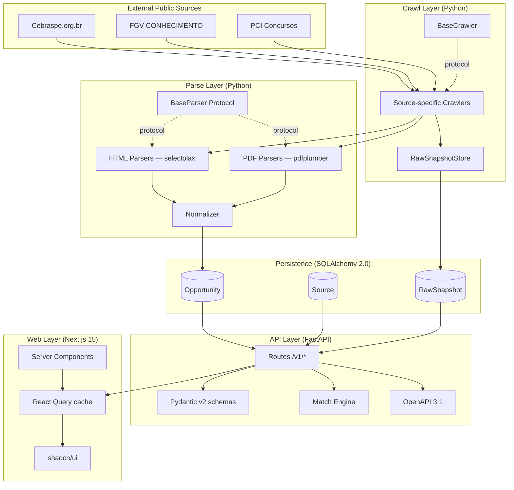
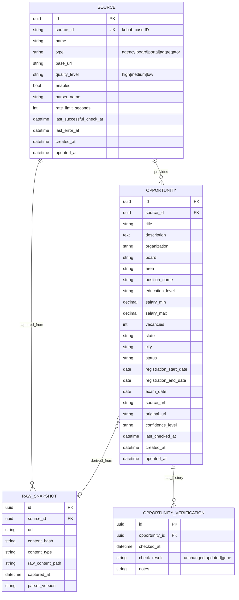

# TECH_FOUNDATION.md

> **Technical companion to [`PRODUCT_FOUNDATION.md`](./PRODUCT_FOUNDATION.md).**
> This file defines **how** we build CivicRadar — architecture, contracts, decisions, patterns.

---

## 1. Technical principles

1. **Simplicity first** — SQLite in the MVP, Postgres only in production. Zero external dependency to run locally.
2. **Plugin architecture for sources** — Adding a new source must be an isolated PR under `crawlers/crawlers/sources/<name>/`, without touching the core.
3. **Deterministic tests** — No test performs real HTTP. HTML/PDF fixtures are captured and versioned.
4. **Total type safety** — `mypy --strict` in Python, `tsc --strict` in TypeScript. No `any`.
5. **Structured logs** — `structlog` on the backend, always JSON in production, always with a correlation ID.
6. **OpenAPI-first** — The schema is the contract. The frontend types itself from the generated OpenAPI.
7. **Accessibility is mandatory** — WCAG 2.1 AA baseline. axe-core in the frontend CI.
8. **Mobile-first responsiveness** — Layouts target mobile first, then expand to tablet/desktop.
9. **Opt-in observability** — Prometheus metrics, structured logs. Nothing sends telemetry by default.
10. **Open data mindset** — Store metadata and links, never copy full third-party content.

---

## 2. Detailed architecture

### 2.1 High-level view



### 2.2 Layers

| Layer | Responsibility | Tech | Tests |
|---|---|---|---|
| **Crawl** | Fetch HTML/PDF content, persist raw snapshot | httpx (async), Playwright (rarely) | HTTP mocked via respx |
| **Parse** | Extract structured data from raw content | selectolax, pdfplumber | Versioned fixtures + golden files |
| **Normalize** | Map to the canonical schema | Pydantic v2 | Per-field unit tests |
| **Persist** | SQLAlchemy 2.0 async storage | SQLite/Postgres + Alembic | In-memory SQLite |
| **API** | HTTP, validation, OpenAPI | FastAPI + Pydantic | TestClient |
| **Match** | Deterministic scoring | Pure Python | Property-based + unit |
| **Web** | Responsive UI | Next.js 15 | Vitest + RTL |

---

## 3. Parser contracts

Every source implements two Protocols:

```python
# crawlers/crawlers/core/protocols.py
from typing import Protocol

from crawlers.core.models import ParsedOpportunity, RawSnapshot


class SourceCrawler(Protocol):
    source_id: str

    async def fetch_list(self) -> list[RawSnapshot]:
        """Fetch the index page and return snapshots with detail URLs."""

    async def fetch_detail(self, snapshot: RawSnapshot) -> RawSnapshot:
        """Fetch a detail page and enrich the snapshot."""


class SourceParser(Protocol):
    source_id: str
    parser_version: str

    def parse(self, snapshot: RawSnapshot) -> list[ParsedOpportunity]:
        """Convert raw content into ParsedOpportunity. Must be deterministic."""
```

### Conventions

- **`source_id`** — kebab-case (`cebraspe`, `fgv`, `pci-concursos`)
- **`parser_version`** — semver (`"1.0.0"`); bump when the output schema changes
- **Idempotency** — Same input → same output, always
- **No side effects in the parser** — It only converts; persistence belongs to the orchestrator
- **Per-field confidence** — The parser may mark fields with `confidence: low|medium|high`

---

## 4. Database schema

### 4.1 ER diagram



### 4.2 Recommended indexes

```sql
-- Performance critical for the most common filters
CREATE INDEX idx_opportunity_status_state ON opportunity(status, state);
CREATE INDEX idx_opportunity_area ON opportunity(area);
CREATE INDEX idx_opportunity_registration_end ON opportunity(registration_end_date);
CREATE INDEX idx_opportunity_source ON opportunity(source_id);

-- Keyword search (SQLite FTS5 / Postgres pg_trgm)
CREATE VIRTUAL TABLE opportunity_fts USING fts5(
    title, description, position_name, organization,
    content=opportunity, content_rowid=rowid
);
```

---

## 5. API design

### 5.1 Versioning

- Major version in the path: `/v1/`, `/v2/`
- Breaking changes only in a new major version
- Minimum 6 months of support for the previous major after a new one ships

### 5.2 Conventions

- **Listings** always return `{"items": [...], "pagination": {...}}`
- **Pagination** is cursor-based (`?cursor=<opaque>&limit=20`)
- **Filtering** uses flat query params (`?state=SP&area=tecnologia`)
- **Search** uses `?q=` (FTS in the DB)
- **Sorting** uses `?sort=field` or `?sort=-field` (descending)
- **Errors** follow RFC 7807 (Problem Details for HTTP APIs)
- **Cache** — `Cache-Control: public, max-age=300` on listings, `ETag` on details

### 5.3 OpenAPI enrichment

```python
app = FastAPI(
    title="CivicRadar API",
    version="0.1.0",
    description=DESCRIPTION_MARKDOWN,
    openapi_tags=TAGS,
    docs_url=None,  # replaced by Scalar
    redoc_url="/redoc",
)


@app.get("/docs", include_in_schema=False)
async def scalar_docs():
    return get_scalar_api_reference(openapi_url=app.openapi_url, title=app.title)
```

Every endpoint defines:
- A short `summary` (one line)
- A rich markdown `description`
- A Pydantic `response_model`
- `responses` for 4xx/5xx with examples
- `tags` for logical grouping

---

## 6. Match engine

### 6.1 Algorithm (deterministic)

Weights from PRODUCT_FOUNDATION §15:

| Criterion | Weight |
|---|---:|
| Area match | 30 |
| Keyword match | 20 |
| Location match | 15 |
| Education level | 15 |
| Salary match | 10 |
| Status/date | 10 |
| **Total** | **100** |

```python
@dataclass(frozen=True)
class MatchResult:
    opportunity_id: UUID
    score: int  # 0-100
    reasons: list[MatchReason]


@dataclass(frozen=True)
class MatchReason:
    criterion: str  # "area" | "keyword" | "location" | ...
    points: int     # 0..weight
    explanation: str
```

### 6.2 Explainability

Every match response includes natural-language reasons (PT-BR/EN), so users understand why an opportunity ranks where it does.

---

## 7. Testing strategy

### 7.1 Pyramid

```
        ▲
        │  E2E (Playwright, smoke only, post-MVP)
        │
        │  Integration (TestClient, in-memory DB)
        │
        │  Unit (pytest, vitest)
        │
        ▼  Static (ruff, mypy, tsc, eslint)
```

### 7.2 Coverage gates

| Layer | MVP | Stable |
|---|---:|---:|
| Backend (`apps/api/`) | 70% | 80% |
| Crawlers (`crawlers/`) | 80% (critical parsers) | 90% |
| Frontend (`apps/web/`) | 50% | 70% |
| Match engine | 95% (deterministic logic) | 95%+ |

### 7.3 Fixtures

- Real HTML/PDF pages captured manually, stored under `crawlers/crawlers/sources/<source>/fixtures/`
- Descriptive names: `concurso_aberto_2024.html`, `edital_completo.pdf`
- Accompanied by `expected.json` (golden file) with the expected output
- A README per source explaining how to refresh fixtures

---

## 8. Logging & observability

### 8.1 structlog

```python
import structlog

log = structlog.get_logger()

# Always with context
log = log.bind(request_id=req_id, source_id="cebraspe")
log.info("crawl.started", url=url)
log.info("crawl.finished", duration_ms=123, items=15)
```

In production: JSON to stdout, external aggregation (Loki / Datadog).
In dev: pretty-printed via Rich.

### 8.2 Metrics

`/metrics` (Prometheus format) is opt-in via `CIVIC_RADAR_METRICS_ENABLED=true`.

Baseline metrics:
- `civic_radar_http_requests_total{method, path, status}`
- `civic_radar_http_request_duration_seconds{method, path}` (histogram)
- `civic_radar_crawl_runs_total{source, status}`
- `civic_radar_parser_errors_total{source, parser_version}`
- `civic_radar_opportunities_total{state, area, status}` (gauge)

---

## 9. Deploy

The MVP is also live in production. Hosting choices below.

| Component | Provider | URL / notes |
|---|---|---|
| **Web** (Next.js 15) | [Vercel](https://vercel.com/) | <https://civic-radar.aldenmerlin.com> · region `gru1` (São Paulo) · `apps/web/vercel.json` configures security headers + GitHub silent mode · Vercel auto-detects Next.js because `rootDirectory=apps/web` is set on the project |
| **API** (FastAPI) | [Railway](https://railway.app/) | <https://civic-radar-production.up.railway.app> · `Dockerfile` build (`apps/api/Dockerfile`) · `numReplicas: 1` · healthcheck on `/health` |
| **DB** (MVP) | SQLite on a Railway volume | 1 GB persistent volume mounted at `/data`; the file is `/data/civic_radar.db`. WAL mode handles the modest concurrency our endpoints need |
| **Crawler jobs** | _not yet scheduled_ | will run as a GitHub Actions cron (free) or a second Railway service when M1.scheduler ships |
| **Snapshots** | Railway volume | `/data/raw_snapshots` (kept on the same volume as the DB for the MVP) |
| **DB** (future, when traffic justifies) | [Supabase](https://supabase.com/) or [Neon](https://neon.tech/) Postgres | Drop-in: switch `CIVIC_RADAR_DATABASE_URL` to a `postgresql+asyncpg://…` connection string and rerun migrations |
| **Analytics** | [Vercel Analytics](https://vercel.com/docs/analytics) + [Speed Insights](https://vercel.com/docs/speed-insights) | Cookie-free Web Vitals capture wired in `apps/web/src/app/layout.tsx` |

### Vercel project settings (mirrored via the Projects API)

- `framework = "nextjs"`
- `rootDirectory = "apps/web"`
- `nodeVersion = "22.x"`
- `ssoProtection = null`
- env vars: `NEXT_PUBLIC_API_URL`, `INTERNAL_API_URL`, `NEXT_PUBLIC_SITE_URL`

### Railway service settings

- Builder: `Dockerfile`, path `apps/api/Dockerfile`
- Volume: `/data`, 1 GB
- Service-level env vars: 10× `CIVIC_RADAR_*` (see `.env.example`), plus `PORT=8000`
- `CIVIC_RADAR_CORS_ORIGINS` must include every public web origin (today: `https://civic-radar.aldenmerlin.com`)

All providers used here have a free tier large enough for the open source phase. Local dev is unchanged — `docker compose up -d` covers both services with the same code.

---

## 10. Security baseline

- **HTTPS only** in production (via PaaS)
- **Strict CORS** — only allowed frontends
- **Rate limiting** via slowapi (60 req/min anonymous)
- **Security headers**: HSTS, X-Frame-Options, X-Content-Type-Options, Referrer-Policy
- **Dependabot** active (weekly)
- **CodeQL scanning** active (weekly)
- **No secrets in code** — `.env` + pydantic-settings, GitHub Secrets in CI
- **No PII storage** — match profiles are request-scoped, never persisted

---

## 11. Versioning & releases

- **SemVer** strict (MAJOR.MINOR.PATCH)
- **Conventional Commits** (`feat:`, `fix:`, `docs:`, `chore:`, `refactor:`, `test:`, `ci:`, `perf:`)
- **CHANGELOG.md** auto-generated via `git-cliff` (post-MVP)
- **GitHub Releases** with human-readable release notes
- **Pre-MVP**: version `0.x.y`, any commit may break the API
- **Post-MVP**: version `1.0.0`, breaking changes only in majors

---

## 12. ADRs (Architecture Decision Records)

Significant architectural decisions live in [`docs/adr/`](./adr/):

- [0001 — Use FastAPI](./adr/0001-use-fastapi.md)
- [0002 — SQLite-first, Postgres-prod](./adr/0002-sqlite-first.md)
- [0003 — AGPL-3.0 license](./adr/0003-agpl-license.md)
- [0004 — shadcn/ui for the frontend](./adr/0004-shadcn-ui.md)
- [0005 — uv + ruff for Python tooling](./adr/0005-uv-ruff.md)
- [0006 — Plugin architecture for crawlers](./adr/0006-crawler-plugins.md)

---

## 13. Links

- [PRODUCT_FOUNDATION.md](./PRODUCT_FOUNDATION.md) — Product vision, scope, principles
- [ARCHITECTURE.md](./ARCHITECTURE.md) — Data flow diagrams
- [DATA_SOURCES.md](./DATA_SOURCES.md) — How to add a new source
- [API.md](./API.md) — Quick API reference
- [CONTRIBUTING.md](./CONTRIBUTING.md) — Setup, standards, workflow
